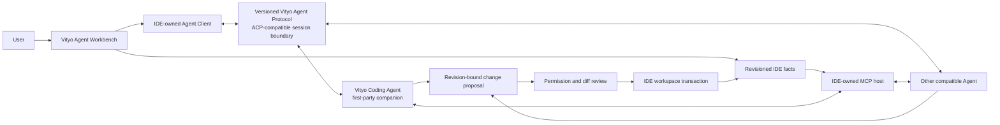

# Vityo Agent-Native IDE Architecture

**Purpose:** Define the stable ownership, state, process, and protocol boundaries between the Vityo IDE, compatible Agents, and the first-party Vityo Coding Agent companion runtime.

**Last updated:** 2026-07-30

**Status:** Current

## 1. Product Boundary

Vityo is the user-facing Styio agent-native IDE. It remains a complete IDE when no Agent is present
and becomes agent-native by treating supervised Agent work as a first-class, reviewable workbench
workflow.

Vityo Coding Agent is the first-party companion runtime. It is independently executable and can be
launched by Vityo or another compatible client. Other compatible Agents may also connect to Vityo.
The IDE never imports an Agent runtime implementation and never becomes a model-provider client.



## 2. Ownership

| Owner | Owns | Does not own |
|---|---|---|
| Vityo IDE | Source Buffers, document/workspace revisions, language/compiler/runtime facts, workbench projections, Agent process supervision, protocol client state, permission presentation, change review, and transaction commit/rollback | Model request shapes, provider credentials, prompt/tool orchestration, Agent tool execution, durable Agent truth, or multi-Agent scheduling |
| Compatible Agent runtime | Model/provider routing, context selection, coding plan and loop, tool/MCP consumption, effect policy, durable sessions, validation orchestration, and optional multi-Agent coordination | IDE buffers, Flutter widgets, implicit machine access, or direct mutation of IDE-owned files |
| Vityo Agent Protocol | Versioned session DTOs, capability negotiation, correlated requests/events, permission and elicitation messages, artifacts, change proposals, receipts, cancellation, and structured errors | Product orchestration, UI state, provider implementation, or shared mutable objects |
| Styio ecosystem | Language, compiler, language-service, project/toolchain, package, execution, and runtime truth | Vityo workbench behavior or Agent orchestration |

The physical owners are:

```text
products/vityo_app/                 # Vityo IDE
products/vityo_coding_agent/        # first-party companion Agent runtime
packages/vityo_agent_protocol/      # pure shared wire contract
```

## 3. IDE State Model

The IDE is authoritative for the state a user can edit, review, or commit.

| State owner | Canonical state | Required behavior |
|---|---|---|
| Document/workspace store | Source text, resource identity, document and workspace revisions | Monotonic revisions and source-fidelity preservation |
| Workspace transaction service | Proposed edits, base revisions, preview, conflicts, commit/rollback receipts | Serialized commit lane; stale or overlapping edits fail without partial mutation |
| Capability registry | Language, toolchain, execution, debug, SCM, terminal, MCP, and Agent capabilities | Immutable snapshots with explicit unavailable/degraded reasons |
| Agent Client registry | Agent descriptors, processes, negotiated versions/capabilities, session correlation | Supervised lifecycle, bounded state, reconnect/cancel/terminate |
| Collaboration projection | Tasks, turns, plans, steps, tool activity, permissions, artifacts, diffs, receipts | Bounded hot history backed by durable Agent/protocol facts |
| Context export | Roots, files, selections, diagnostics, symbols, project graph, runtime and validation facts | Revision, provenance, sensitivity, redaction, and truncation metadata |

Flutter widgets render projections of these states. Widget lifetime is never the source of session,
permission, change, or execution truth.

## 4. Agent Client Boundary

The IDE-owned Agent Client:

1. discovers a configured Agent command or remote transport;
2. launches or connects to it without exposing unrelated environment or credentials;
3. negotiates protocol version and capabilities;
4. creates, loads, streams, cancels, reconnects to, and terminates sessions;
5. correlates concurrent sessions, requests, permissions, artifacts, and change proposals;
6. projects durable protocol events into bounded workbench state;
7. rejects malformed, oversized, unsupported, or stale messages with structured diagnostics.

The preferred local transport is a supervised stdio process. Alternate transports may be added
behind the same session semantics. Styio-specific additions are namespaced and capability-negotiated;
they do not fork or silently reinterpret standard protocol messages.

The IDE does not:

1. send prompts directly to OpenAI-compatible or other model endpoints;
2. select model-provider fallback routes;
3. execute an Agent's tool loop;
4. persist the Agent's authoritative reasoning/session journal;
5. schedule subagents or worktrees.

Those responsibilities belong to the connected Agent runtime.

## 5. Context and Tool Flow

The IDE exposes bounded context and capabilities through narrow protocol messages and an
MCP-compatible host:

1. Workspace roots are explicit, canonicalized, user-consented capabilities.
2. Context items carry resource identity, revision, provenance, sensitivity, and truncation facts.
3. Secrets and unrelated environment values are excluded before serialization.
4. Root removal or permission revocation invalidates cached access before the next effect.
5. Tools use versioned schemas, bounded inputs/outputs, structured errors, cancellation, and
   capability discovery.
6. Tool declarations and model text are requests to policy, never enforcement authority.

An Agent runtime may decide which context and tools are relevant, but it cannot widen the IDE's
exported roots, schemas, permissions, or capability set.

## 6. Change and Effect Flow

```text
Agent plan
  -> tool/effect request
  -> runtime and host policy
  -> user permission when required
  -> effect receipt
  -> revision-bound change proposal
  -> IDE diff/conflict preview
  -> user accept or reject
  -> IDE workspace transaction
  -> diagnostics/tests/validation facts
  -> durable receipt
```

Required invariants:

1. Agent-originated edits never bypass the workspace transaction owner.
2. A proposal is bound to the revisions from which it was derived.
3. Stale, conflicting, malformed, or unauthorized proposals fail closed.
4. Apply/reject/revert actions remain explicit and receipted.
5. Validation facts are re-read after accepted changes; model claims are not validation.
6. Mutating effects use explicit commit and idempotency boundaries in the Agent runtime.

## 7. Agent Workbench

Agent-native is an interaction and control property, not a synonym for chat.

The workbench provides:

1. a task center for active, waiting, blocked, completed, failed, and cancelled work;
2. session/thread views with user and Agent turns, plans, steps, usage, and context summaries;
3. an activity timeline for tools, permissions, terminal activity, diagnostics, and validations;
4. change views with file/hunk diffs, base revisions, conflicts, apply/reject/revert controls;
5. steer, cancel, retry, reconnect, and Agent-switch controls;
6. persistent notifications for unresolved permission and review requests;
7. independent state for concurrent sessions.

An `Agent Panel` may remain one concrete presentation surface. It is a view into the Agent
Workbench, not the product category and not the runtime owner.

## 8. Security and Failure Isolation

1. The IDE sends an Agent process only the environment values intended for that process.
2. Provider credentials are resolved and consumed inside the Agent runtime's intended provider
   boundary; the IDE does not relay raw model credentials.
3. Protocol, MCP, terminal, tool, context, artifact, and diff payloads are bounded and redacted.
4. Permission grants are scoped by session, action/tool, root/resource, risk, expiry, and policy.
5. Revocation is enforced before the next effect.
6. One failed Agent process or session cannot corrupt editor state or terminate sibling sessions.
7. Process shutdown uses graceful termination, bounded escalation, and orphan verification.
8. Unsupported protocol versions, capabilities, or transports fail closed with actionable
   diagnostics.

## 9. Platform Routes

| Platform | Agent route |
|---|---|
| Windows / macOS / Linux | Supervised local companion process or compatible remote Agent |
| Android | Compatible local or remote Agent when allowed by platform capabilities |
| iOS | Remote compatible Agent through an iOS-safe transport |
| Web | Remote compatible Agent associated with the hosted workspace |

Platform transport differences do not move model/provider or Agent execution ownership into the IDE.

## 10. Current Implementation Gap

The target boundary above is authoritative. Some current Vityo IDE files still contain direct
provider transport, provider configuration, prompt contract, and coding-session controller behavior
that predates the standalone companion runtime. Those files are current implementation evidence,
not the intended ownership model.

Their retirement or migration into `products/vityo_coding_agent` is tracked in
[Vityo-Implementation-Gaps.md](./Vityo-Implementation-Gaps.md). This documentation convergence does
not claim that code migration has occurred and does not change public runtime behavior.

## 11. Related Owners

1. [Vityo Product Spec](./Vityo-Product-Spec.md)
2. [Vityo System Architecture](./Vityo-System-Architecture.md)
3. [Vityo Protocol and Capability Negotiation](./Vityo-Protocol-And-Capability-Negotiation.md)
4. [Vityo IDE plan architecture](../plan/vityo/Architecture.md)
5. [Vityo Coding Agent plan architecture](../plan/vityo-coding-agent/Architecture.md)
6. [ADR-0019](../adr/ADR-0019-vityo-is-the-styio-agent-native-ide.md)
