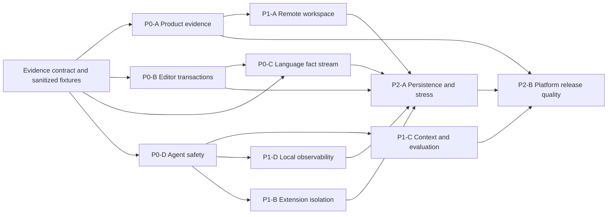

# Vityo Mainstream Open-Source Improvement Plan

**Purpose:** Define the current evidence-based improvement sequence for Vityo by comparing its implemented product boundaries with recurring practices in mainstream open-source editor, IDE, coding-agent, protocol, security, and observability projects.

**Last updated:** 2026-08-02

**Status:** Proposed product-improvement source. This document prioritizes future closures; it does not authorize implementation or replace Better Plan execution state.

## 1. Outcome And Scope

The next Vityo stage must turn an extensive contract-and-test foundation into a product that is
credible under real editing, language, execution, remote-workspace, extension, and Agent workloads.
The target is not competitor feature parity. The target is a smaller Styio-native system whose
critical paths are measurable, recoverable, isolated, and independently reviewable.

The comparison covers the mainstream implementation families that materially affect Vityo:

1. editor and workbench platforms: Code - OSS, Eclipse Theia, Zed, Lapce, and CodeMirror 6;
2. parsing and tool protocols: Tree-sitter, LSP, and DAP;
3. coding-agent systems: OpenHands, Continue, Aider, Cline/Roo Code, and SWE-agent;
4. interoperability and operations: MCP and OpenTelemetry.

"Mainstream" means a representative, actively maintained implementation with a reusable practice,
not every repository that describes itself as an IDE or Agent. Evidence was frozen on 2026-08-02
from project-owned documentation and repositories. A framework name is a provenance label only;
Vityo must adopt the underlying practice only when it improves a Vityo acceptance outcome.

## 2. Source-Grounded Baseline

Vityo already has the right coarse ownership model:

- `products/vityo_app/` owns the IDE, workspace revision, user review, and source mutation;
- `products/vityo_coding_agent/` owns model/provider access, context selection, tool policy,
  durable Agent sessions, and orchestration;
- `packages/vityo_agent_protocol/` is the versioned boundary between them;
- `view_ide/` and `view_render/` separate product state/contracts from Flutter presentation;
- architecture, security, performance, documentation, and product-line gates already exist.

The current risk is not an absence of models or contracts. It is the distance between isolated
implementation anchors and exercised product behavior:

| Area | Current evidence | Material closure still needed |
|---|---|---|
| Editor | Piece-tree buffer, transactions, selection, virtualization and micro-benchmarks exist. | Multi-cursor, complete IME/grapheme behavior, large-file degradation, and frame-level product measurements. |
| Language | Capability routing, revisioned caches, semantic snapshots, and stale-result rejection exist. | Compiler-owned type/scope/reference facts, long-lived service behavior, rename, actions, formatting, inlay hints, and real asynchronous product evidence. |
| Workspace | Local, memory, browser, and hosted document providers exist. | A complete remote authority split, non-document hosted operations, reconnection, conflict, retention, and export flows. |
| Extension runtime | Manifests, contribution routing, lifecycle, package policy, and isolation models exist. | A real least-privilege execution boundary, health/resource enforcement, signed provenance, staged activation, and rollback evidence. |
| Agent | Protocol client, permissions, revision-bound apply, context engine, tool runtime, journal, recovery, evaluation corpus, and multi-Agent structures exist. | Adversarial interoperability, sandbox containment, measurable task quality/cost, low-sensitive observability, and complete Workbench product flows. |
| Delivery | Broad unit and policy gates exist. | Fewer proxy-only claims, more real product paths, platform-native evidence, reproducible artifacts, and release rollback drills. |

The active gap authority remains
[Vityo-Implementation-Gaps.md](./Vityo-Implementation-Gaps.md). Completed facts remain in
[Vityo-Delivered-Design-Baseline.md](./Vityo-Delivered-Design-Baseline.md). This plan orders
closures and acceptance; it must not duplicate their detailed ledgers.

## 3. Open-Source Practices Worth Adopting

| Reference | Reusable implementation practice | Vityo decision |
|---|---|---|
| [Code - OSS source organization](https://github.com/microsoft/vscode/wiki/source-code-organization) | Layered core, minimal workbench, separate extension host, explicit desktop/web/server composition roots. | Keep the current IDE/render split, but add executable dependency and runtime-isolation evidence; do not add VS Code API compatibility. |
| [Eclipse Theia architecture](https://theia-ide.org/docs/architecture/) | Common/frontend/backend separation and a replaceable remote backend connected through explicit RPC. | Model local and hosted workspaces through one authority contract with local UI state; do not inherit Theia's Node/DOM stack. |
| [Eclipse Theia extension types](https://theia-ide.org/docs/extensions/) | Compile-time extensions, connection-scoped plugin processes, and headless backend plugins have different trust and lifecycle boundaries. | Split trusted built-ins from untrusted installable modules; never represent all extension kinds as one isolation level. |
| [Zed remote development](https://zed.dev/docs/remote-development) | UI and unsaved buffers remain local while source authority, language servers, tasks, and terminals run remotely. | Adopt this ownership split for hosted workspaces and make disconnect/reconnect semantics explicit. |
| [Zed language extensions](https://zed.dev/docs/extensions/languages) | Tree-sitter grammars plus LSP servers; extension inputs are revision-pinned. | Keep compiler-owned semantics, but use a pinned incremental syntax layer for immediate, non-authoritative editor structure. |
| [CodeMirror 6 reference](https://codemirror.net/docs/ref/) | Immutable editor state, changes as transactions, mapped selections, viewport rendering, and lazy derived state. | Make every editor mutation and selection update one revisioned transaction; avoid parallel mutable UI/editor state. |
| [Tree-sitter](https://tree-sitter.github.io/) | Incremental, error-tolerant parsing fast enough for each edit. | Use only as an editor-local syntax and structural-query layer when Styio supplies a supported grammar; semantic authority stays with Styio. |
| [LSP](https://microsoft.github.io/language-server-protocol/) | Capability negotiation, document synchronization, cancellation, progress, partial results, and reusable language-server boundaries. | Align behavior and test vocabulary with the current 3.18 family without claiming wire compatibility; missing capability must remain explicit. |
| [DAP](https://microsoft.github.io/debug-adapter-protocol/) | Backward-compatible capability flags and a separate debug adapter boundary. | Preserve Vityo's typed debug contract, but require capability-driven launch, cancellation, pagination, and stale-session rejection. |
| [OpenHands runtime architecture](https://docs.openhands.dev/openhands/usage/architecture/runtime) | Arbitrary Agent actions execute in a disposable client/server sandbox rather than the host process. | Move effectful Agent tools behind a sandbox port with bounded mounts, network, process, time, and resource policy. |
| [Continue configuration](https://docs.continue.dev/reference) | Versioned composition of models, rules, context, and tools with explicit model capabilities. | Keep provider configuration Agent-owned and add schema migration plus capability-derived UX; do not put provider configuration in the IDE. |
| [Aider repository map](https://aider.chat/docs/repomap.html) | Token-budgeted repository summaries ranked from a dependency/symbol graph. | Extend Vityo's revisioned context engine with incremental symbol/dependency ranking and provenance-aware evaluation. |
| [MCP 2025-11-25 core](https://modelcontextprotocol.io/specification/2025-11-25/basic) | Schema-first capability negotiation and current task/tool primitives. | Implement conformance fixtures at the Agent boundary and reject unsupported schema dialects or capabilities explicitly. |
| [MCP authorization](https://modelcontextprotocol.io/specification/2025-11-25/basic/authorization) | OAuth 2.1, PKCE, audience binding, secure token storage, and prohibition of token passthrough. | Treat remote MCP authorization as a separate security closure; credentials and raw authorization data must never enter IDE facts or journals. |
| [OpenTelemetry semantic conventions](https://opentelemetry.io/docs/specs/semconv/) | Stable names for traces, metrics, logs, and errors, with explicit stability and cardinality rules. | Define a local-first, redacted Agent/workflow schema; content capture remains off and no product telemetry is added. |

Lapce, Cline/Roo Code, and SWE-agent remain comparison inputs for Rust/editor performance,
checkpointed human approval, and reproducible benchmark trajectories respectively. No distinct
Vityo initiative depends on copying their APIs, so they do not create additional architecture
layers.

## 4. Non-Negotiable Design Constraints

1. The no-Agent `edit -> analyze -> test -> run -> observe` loop remains complete.
2. The IDE never imports a model SDK, provider implementation, coding loop, or Agent tool runtime.
3. Only an IDE-owned revision-checked workspace transaction may mutate source.
4. Styio remains the authority for syntax validity and semantics. An incremental editor parser is
   responsive assistance, never a competing compiler.
5. Every remote, extension, tool, and Agent capability is negotiated and may fail closed with a
   user-visible reason.
6. No raw secrets, prompts, source content, personal data, machine identity, or backend runtime data
   enter logs, evidence, diagnostics, or generated plan state.
7. Product telemetry remains absent. Developer diagnostics are local, opt-in, bounded, redacted,
   and disposable.
8. A closure owns one capability or end-to-end scenario. A change must not combine unrelated editor,
   language, remote, extension, and Agent work.
9. Existing compatibility facades are not a destination. Any future refactor removes the old
   implementation and validates its absence in the same migration.

## 5. Prioritized Improvement Closures

### P0-A: Make Product Evidence More Authoritative Than Proxy Evidence

**Objective:** A release claim must be backed by the installed application exercising public owner
contracts, not only by unit models or synthetic route summaries.

**Closure:**

1. Freeze one sanitized Styio workspace fixture and machine-contract fixture set.
2. Drive open, edit, save, analyze, test, run, observe, failure, cancel, and recovery through the
   real composition root.
3. Record bounded receipts containing versions, capability states, revisions, durations, outcomes,
   and artifact digests only.
4. Run the focused product scenario per implementation closure; reserve the full platform matrix
   for the final release gate.

**Acceptance:** The same scenario passes locally without an Agent, passes with a compatible Agent
connected, rejects stale or incompatible contracts, and exposes no raw runtime or source payload in
evidence. A mocked adapter result alone cannot satisfy the gate.

### P0-B: Complete The Editor As A Transactional Input System

**Objective:** Reach predictable modern-editor behavior before expanding visual features.

**Execution status (2026-08-02):** The first independently accepted core closure is complete:
immutable normalized multi-selection state, explicit boundary-aware edit mapping, duplicate/conflict
normalization, one-revision commits, and complete one-intent undo/redo now share one owner. Remaining
P0-B work is deliberately separate: user-facing multi-cursor/rectangular-selection commands,
composition and grapheme/bidi policy, platform input/accessibility evidence, and rendered latency.

**Closure:**

1. Unify text, selection, undo grouping, composition, and workspace edits under revisioned
   transactions with deterministic selection mapping.
2. Add multi-cursor commands, overlapping-edit normalization, rectangular selection policy, and
   paste/undo semantics.
3. Complete IME composition, grapheme cluster, bidirectional text, dead-key, accessibility, and
   clipboard tests on supported platforms.
4. Enforce viewport-only decorations and parsing, cancellable background work, and explicit
   large-file degradation.
5. Replace algorithm-only latency claims with application frame, startup, memory, and long-session
   measurements on a declared reference class of machine.

**Acceptance:** No keystroke or composition loss; one undo restores one user intent; multi-cursor
edits are deterministic; stale decorations never apply; the current interaction-quality budgets
pass in a rendered application with 10k- and 100k-line fixtures.

### P0-C: Establish One Compiler-Owned Language Fact Stream

**Objective:** Remove ambiguity between local heuristics, cached projections, and authoritative
Styio facts.

**Closure:**

1. Publish the upstream capability/version contract for diagnostics, tokens, types, scope graph,
   symbols, references, rename, code actions, formatting, inlay hints, cancellation, and partial
   results.
2. Bind every request and result to workspace, document, revision, toolchain, provider, and protocol
   identities.
3. Keep one long-lived service session with bounded restart/backoff and observable degraded states.
4. Remove local semantic heuristics as each compiler fact becomes available; retain only syntax-
   local editor assistance.
5. Route every returned edit through the same previewable workspace transaction used by Agent
   changes.

**Acceptance:** Delayed results from an old revision cannot alter any surface; rename and code
actions preview all files atomically; service restart preserves source truth; unsupported features
show a structured blocked reason. Upstream Styio contract publication is an explicit prerequisite,
not work to simulate inside Vityo.

### P0-D: Prove The Agent Safety And Interoperability Boundary

**Objective:** A connected Agent may propose and execute bounded work without gaining ambient IDE
or host authority.

**Closure:**

1. Freeze protocol conformance fixtures for negotiation, task lifecycle, streaming, cancellation,
   reconnect, permission requests, revision conflicts, and unknown fields.
2. Put effectful tools behind a disposable sandbox port with explicit roots, network destinations,
   environment allowlists, process/time/memory limits, and effect receipts.
3. Make grants capability-, workspace-, task-, operation-, and expiry-scoped; test revocation and
   confused-deputy paths.
4. Add MCP schema, authorization, task ownership, cancellation, and rate/resource-limit fixtures.
5. Exercise the complete Workbench loop: plan visibility, context provenance, permission decision,
   change preview, IDE-owned apply/rollback, verification, and recovery.

**Acceptance:** An adversarial compatible Agent cannot write outside the approved workspace, reuse
a grant for another task, apply a stale patch, smuggle a token, bypass review, or leave an
uncorrelated effect. Killing either side during each effect boundary recovers to one idempotent
outcome.

### P1-A: Make Local And Remote Workspaces One Authority Model

**Objective:** Hosted workspaces become a real product path without leaking remote concerns into
editor state.

**Closure:**

1. Define local UI/buffer ownership versus remote source, language, task, terminal, debug, and
   source-control ownership.
2. Generalize document-only hosted operations into capability-negotiated filesystem and process
   services only after their owner contracts exist.
3. Add offline dirty-buffer, reconnect, remote-revision conflict, lease expiry, retention, export,
   deletion, and recovery state machines.
4. Test latency, bandwidth loss, reordering, duplication, disconnect, server replacement, and
   credential expiry with deterministic fault injection.

**Acceptance:** Reconnect never loses an unsaved local edit or silently overwrites a newer remote
revision; unsupported remote operations are blocked; close/export/delete behavior is user-visible
and independently auditable.

### P1-B: Turn Extension Isolation From A Model Into A Runtime Boundary

**Objective:** Installable modules cannot crash, inspect, or mutate the IDE outside declared APIs.

**Closure:**

1. Classify trusted built-ins, same-process declarative assets, sandboxed code, separate-process
   adapters, and hosted extensions as different trust products.
2. Restrict installable code to a versioned, capability-scoped RPC surface; prefer a portable
   sandbox such as WASM where the required Dart/Flutter host support is mature enough.
3. Verify signature/provenance, unpack safely, stage atomically, health-check before activation,
   meter resources, quarantine crashes, and roll back deterministically.
4. Show activation time, failures, permissions, resource usage, and update provenance locally to the
   user.

**Acceptance:** Malformed, unsigned, path-traversing, over-budget, incompatible, or crashing modules
cannot activate or destabilize the workbench; a failed upgrade restores the previous version and
its compatible data schema.

### P1-C: Make Context Quality And Agent Evaluation Reproducible

**Objective:** Improve Agent success by measuring context and tool decisions, not by increasing
token volume or adding provider-specific branches.

**Closure:**

1. Build an incremental symbol/dependency graph with revision and provenance on every context item.
2. Rank by task evidence, graph relevance, recency, change risk, and diversity under explicit token
   and memory budgets; cache by content digest and dependency version.
3. Version a sanitized evaluation corpus for navigation, focused edits, multi-file changes,
   tests/repair, permission denial, stale revisions, tool failure, and recovery.
4. Score correctness, unnecessary edits, test validity, permission prompts, retries, tool errors,
   latency, tokens, and cost separately; never collapse them into one opaque score.
5. Store replayable, redacted trajectories and compare provider/model configurations outside the
   IDE product boundary.

**Acceptance:** Every release reproduces corpus results from a clean environment; context selection
has provenance and bounded cost; quality regression thresholds are explicit; no evaluation fixture
contains private repositories, secrets, machine identity, or backend runtime data.

### P1-D: Add Local, Redacted End-To-End Observability

**Objective:** A developer can explain latency or failure across IDE, Agent, tool, Styio, and Pafio
boundaries without capturing sensitive content.

**Closure:**

1. Define low-cardinality operation names and correlation fields for workspace transaction,
   language request, Agent turn, model call, tool call, permission, sandbox effect, and verification.
2. Separate duration spans, point-in-time events, and aggregate metrics; bound queues and sampling.
3. Default all content fields off; apply structural redaction before storage or export; keep local
   retention short and explicit.
4. Add a developer-only trace viewer that links a user-visible blocked/error state to sanitized
   component receipts.

**Acceptance:** One correlation ID explains a complete task without source, prompt, tool output,
credential, personal, machine, or backend data. Disabling diagnostics removes the runtime overhead
and emits nothing externally.

### P2-A: Finish Persistence, Recovery, And Long-Session Reliability

**Objective:** Restart, upgrade, crash, and prolonged use preserve user intent without retaining
unbounded state.

**Closure:**

1. Adopt the DataStore/Registry ownership contracts for editor sessions, runtime state, appearance,
   extensions, and recoverable Agent projections; remove ad-hoc stores in the same migrations.
2. Define schema migration, compaction, TTL, quota, corruption, partial-write, and fallback policy per
   owner.
3. Add 8-hour bounded stress scenarios for edit/save/watch, language churn, terminal output, Agent
   events, extension restart, and remote reconnect.
4. Verify that closing work returns memory, descriptors, watchers, processes, caches, and temporary
   artifacts toward baseline.

**Acceptance:** Crash recovery is idempotent, corrupt optional state cannot block project access,
memory growth plateaus, and the absence of every removed legacy store is mechanically verified.

### P2-B: Close Cross-Platform Interaction And Release Quality

**Objective:** Desktop, web, and mobile claims are backed by native interaction and packaging
evidence rather than shared-widget assumptions.

**Closure:**

1. Complete keyboard, screen-reader, IME, focus, contrast, narrow-viewport, touch, clipboard,
   file-dialog, terminal, and process-lifecycle matrices per supported platform.
2. Build signed, reproducible packages with SBOM, provenance, vulnerability policy, staged update,
   rollback, uninstall, and data-retention verification.
3. Separate smoke, focused capability, product scenario, platform packaging, and full release gates
   so ordinary changes do not rerun the entire matrix.
4. Publish support tiers and fail closed for platform capabilities that lack product evidence.

**Acceptance:** Each advertised platform has a native package, install/update/rollback/uninstall
drill, core keyboard or touch walkthrough, accessibility evidence, and the no-Agent developer loop.
Unsupported tiers are not presented as production-ready.

## 6. Dependency And Delivery Sequence

Only the arrows above are proposed execution prerequisites. Work in the same frontier should remain
independent and own disjoint paths. In particular, editor, upstream language-contract, and Agent
safety closures may begin after the shared evidence contract without waiting for each other.

When implementation is authorized, each `P*-*` closure must become its own Better Plan task group
bound to one examined capability. Do not create one repository-wide group. Each group must freeze
focused regression once, run it once after verification, and defer the full regression to its final
validation node.

## 7. Acceptance Scorecard

| Dimension | Required release evidence |
|---|---|
| Product truth | Real no-Agent and connected-Agent developer loops through public contracts. |
| Editor correctness | Multi-cursor, IME/grapheme, undo intent, stale-decoration, large-file, and rendered latency evidence. |
| Language correctness | Revision-safe authoritative facts, cancellation, restart, rename/action transaction preview, and explicit capability gaps. |
| Security | Sandbox escape, path traversal, token audience/passthrough, permission reuse, stale patch, package provenance, and redaction tests. |
| Remote reliability | Conflict, disconnect, reconnect, lease, retention, export, deletion, and deterministic fault-injection evidence. |
| Agent quality | Versioned sanitized corpus with correctness, edit minimality, tool, permission, retry, latency, token, and cost dimensions. |
| Resource behavior | Startup/frame timings, memory plateau/reclamation, watcher/process/file-descriptor cleanup, and bounded queues/caches. |
| Accessibility | Keyboard/touch, focus, screen reader, contrast, IME, and narrow-viewport evidence per advertised tier. |
| Release | Reproducible signed artifacts, SBOM/provenance, platform install/update/rollback/uninstall, and support-tier declaration. |

No capability advances on documentation volume, class count, unit-test count, or a synthetic
benchmark alone. Advancement requires an observable product outcome, focused executable evidence,
and a recorded blocked state for every missing external prerequisite.

## 8. Explicit Non-Goals

- VS Code extension API or Marketplace compatibility.
- Replacing Flutter with Electron, a browser DOM workbench, or a Rust rewrite.
- Replacing Styio compiler semantics with Tree-sitter, regexes, or IDE heuristics.
- Moving provider credentials, model routing, prompt policy, or coding loops into the IDE.
- Enabling arbitrary extension or Agent code in the IDE process.
- Adding cloud telemetry, usage analytics, source capture, prompt capture, or default content tracing.
- Claiming a platform, remote operation, language feature, or protocol capability before its real
  owner contract and product evidence exist.
- Expanding all initiatives in one refactor or preserving old implementations after a migration.

## 9. Maintenance Rule

Re-audit the reference catalog when a source protocol changes materially or before promoting a
major capability. Update this document only when the ordering, acceptance boundary, or non-goals
change. Record detailed current-state movement in
[Vityo-Implementation-Gaps.md](./Vityo-Implementation-Gaps.md), stable completed outcomes in
[Vityo-Delivered-Design-Baseline.md](./Vityo-Delivered-Design-Baseline.md), and executable work only
in the canonical Better Plan workspace.
