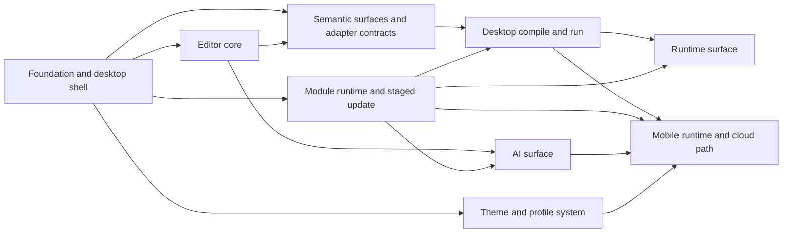

# Vityo Initial Implementation Milestones

**Purpose:** 冻结 `Vityo` 初始实施功能主题、依赖链和验收门禁；具体任务见各主题文件。

**Last updated:** 2026-04-12

**Status:** Active milestone set

## 1. 目标

把 `Vityo` 从“仅有方向”推进到“桌面最小闭环 + 模块宿主与 staged update 基线 + 运行视图骨架 + AI 面板骨架 + 移动端分平台策略”。

## 2. 功能主题

| Theme | File | Goal |
|-------|------|------|
| Foundation and desktop shell | [FOUNDATION-AND-DESKTOP-SHELL.md](./FOUNDATION-AND-DESKTOP-SHELL.md) | 冻结工程骨架、文档、Flutter 桌面壳与基础导航 |
| Editor core | [EDITOR-CORE.md](./EDITOR-CORE.md) | 建立自研文档模型、输入、选择、渲染基本盘 |
| Semantic surfaces and adapter contracts | [SEMANTIC-SURFACES-AND-ADAPTER-CONTRACTS.md](./SEMANTIC-SURFACES-AND-ADAPTER-CONTRACTS.md) | 冻结语言层产品合同、语义表面与 `CLI / FFI / Cloud` adapter 槽位 |
| Desktop compile and run | [DESKTOP-COMPILE-AND-RUN.md](./DESKTOP-COMPILE-AND-RUN.md) | 桌面端完成保存编译、快捷键运行和诊断闭环 |
| Runtime surface | [RUNTIME-SURFACE.md](./RUNTIME-SURFACE.md) | 交付底部运行视图、线程轨与图模型最小闭环 |
| AI surface | [AI-SURFACE.md](./AI-SURFACE.md) | 交付 IDE 内建 AI 面板、prompt profile 与上下文注入 |
| Theme and profile system | [THEME-AND-PROFILE-SYSTEM.md](./THEME-AND-PROFILE-SYSTEM.md) | 交付主题分层、预设主题与 profile 骨架 |
| Mobile runtime and cloud path | [MOBILE-RUNTIME-AND-CLOUD-PATH.md](./MOBILE-RUNTIME-AND-CLOUD-PATH.md) | 交付 Android 本地优先、iOS 云执行与 Web hosted workspace 主路径 |
| Module runtime and staged update | [MODULE-RUNTIME-AND-STAGED-HOT-UPDATE.md](./MODULE-RUNTIME-AND-STAGED-HOT-UPDATE.md) | 交付模块挂载、卸载、分端能力矩阵、数据回收与 staged update |

## 3. 依赖图

## 4. 门禁

1. 每个里程碑都必须有明确退出条件。
2. 没有对应 ADR 的长期架构边界不得推进到实现。
3. 任何平台承诺都必须能映射到 `docs/assets/workflow/TEST-CATALOG.md`。
