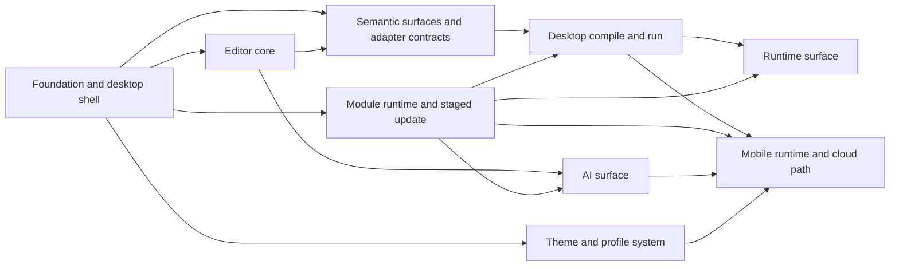

# Source Material

This file preserves the full content of planning sources imported into the current Better Plan workspace. The source labels match the Evidence ledger; old planning roots are not active navigation.

## source-001-ai-surface: AI SURFACE

```text
# AI Surface

**Purpose:** 鎶� AI 鍗忎綔闈㈡澘鍋氭垚 IDE 涓�绛夎兘鍔涳紝鏀�鎸佽嚜瀹氫箟 prompt銆佷笂涓嬫枃娉ㄥ叆銆乸rovider adapter 鍜屽�栨帴缁勪欢鎺ュ叆銆�

**Last updated:** 2026-04-12

**Status:** In Progress

## 1. 鐩�鏍�

1. 鐢ㄦ埛鏃犻渶绂诲紑 IDE 鍗冲彲涓� coding agent 浜や簰銆�
2. prompt profile銆佹枃浠朵笂涓嬫枃銆佽瘖鏂�鍜岃繍琛屾�佷笂涓嬫枃鍙�娉ㄥ叆銆�
3. 鍦ㄦ病鏈夋湰鍦� agent 鍜屾病鏈変簯 sync 缁勪欢鐨勬儏鍐典笅锛屽熀纭� AI 闈㈡澘浠嶅彲宸ヤ綔銆�

## 2. 浠诲姟

| Workstream | Deliverable | Dependency | Exit |
|------------|-------------|------------|------|
| Agent session contract | 瀹氫箟 `AgentSession` 涓� provider 鎶借薄 | Foundation and desktop shell | 鏈�鍦�/浜戠��鎺ュ彛缁熶竴 |
| AI panel shell | 瀹炵幇搴曢儴鎴栦晶杈� AI 闈㈡澘楠ㄦ灦 | Shell layout | 闈㈡澘鍙�鐢� |
| Prompt profile model | 璁捐�� prompt profile 鏁版嵁妯″瀷 | Agent session contract | prompt 鍙�鎸佷箙鍖� |
| Editor context injection | 娉ㄥ叆褰撳墠鏂囦欢銆侀�夊尯銆佽瘖鏂�涓婁笅鏂� | Diagnostic feedback route | agent 鏀跺埌 IDE 涓婁笅鏂� |
| Runtime context injection | 娉ㄥ叆杩愯�屾�佷笂涓嬫枃 | Runtime surface | agent 鍙�璇绘墽琛屼俊鎭� |
| Provider selection | 璁捐�℃湰鍦� provider 涓庝簯 provider 閫夋嫨閫昏緫 | Agent session contract | provider 鍙�鍒囨崲 |
| Suggested edit application | 涓哄悗缁�琛ヤ竵/浠ｇ爜寤鸿��棰勭暀搴旂敤鎺ュ彛 | Editor context injection | UI 鑳芥壙杞藉缓璁�缁撴灉 |
| Cloud provider adapter | 瀹氫箟 OpenAI-compatible cloud provider adapter | Agent session contract | 鍙�鎺ラ�氭爣鍑嗗吋瀹圭��鐐� |
| Local agent bridge | 棰勭暀鏈�鍦板�栨帴 agent bridge | Agent session contract | 鏈�鍦� agent 鍙�鍚庢帴鍏� |
| Profile sync adapter | 瀹氫箟 `ProfileSyncAdapter` 涓� local-only fallback | Prompt profile model | 鏃� sync 鏃朵篃鍙�鐢� |
| Prelaunch provider configuration | 鍑嗗�囬�勪笂绾� OpenRouter 绫� provider 閰嶇疆浣� | Cloud provider adapter | 棰勪笂绾垮彲鐩存帴鎺ヤ簯 provider |
| AI viewport family | 璁� AI surface 璺熼殢缁熶竴瑙嗙獥鏃忓垏鎹㈡�岄潰/绉诲姩鎺掔増 | Viewport families and AI panel shell | AI 闈㈡澘涓嶅啀涓庝富澹冲竷灞�鑴辫妭 |

## 3. 闂ㄧ��

1. AI 闈㈡澘涓嶅啀鏄�澶栭儴閾炬帴锛岃�屾槸 IDE 鍐呭缓闈㈡澘銆�
2. 鐢ㄦ埛鍙�缂栬緫鍜屼繚瀛橀�勮緭鍏� prompt銆�
3. agent 鑷冲皯鑳借�诲彇褰撳墠宸ヤ綔涓婁笅鏂囥��
4. 鏃犳湰鍦� agent 鍜屾棤 sync 缁勪欢鏃讹紝鍩虹�� AI 闈㈡澘浠嶄笉澶辨晥銆�

## 4. Current implementation anchor

褰撳墠浠ｇ爜鍏ュ彛锛�

1. `frontend/vityo_app/lib/src/agent/agent_surface.dart`
2. `frontend/vityo_app/lib/src/app/layout/vityo_shell_scaffold.dart`

褰撳墠宸茶惤鍦帮細

1. `AgentSurface` 宸叉寜 `ViewportProfile` 鍒囨崲妗岄潰/绉诲姩涓ゅ�楁帓鐗�
2. agent 鐩稿叧妯″潡杩囨护宸插垏鍒� `ModuleSlot.agentSurface / cloudRuntime`
3. iOS cloud-first 鍚堣�勮矾寰勫拰 desktop local-bridge 棰勭暀宸茬粡杩涘叆 UI 鍗犱綅缁撴瀯
```

## source-002-desktop-compile-and-run: DESKTOP COMPILE AND RUN

```text
# Desktop Compile And Run

**Purpose:** 鍦ㄦ�岄潰绔�浜や粯淇濆瓨缂栬瘧銆佸揩鎹烽敭杩愯�屻�佽瘖鏂�鍥炴寚鍜屾渶灏忚繍琛岄棴鐜�銆�

**Last updated:** 2026-04-12

**Status:** In Progress

## 1. 鐩�鏍�

1. 鐢ㄦ埛淇濆瓨鎴栨樉寮忚繍琛屾椂锛屽彲缂栬瘧骞舵墽琛屾渶灏忓悎娉曞崟鍏冦��
2. 缂栬瘧鍜岃繍琛岀粨鏋滆兘鍥炴祦鍒扮紪杈戝櫒涓庡簳閮ㄩ潰鏉裤��

## 2. 浠诲姟

| Workstream | Deliverable | Dependency | Exit |
|------------|-------------|------------|------|
| Save-triggered compile policy | 瀹氫箟淇濆瓨鍚庤嚜鍔ㄧ紪璇戠瓥鐣ヤ笌閰嶇疆椤� | Pipeline visual substitution | 琛屼负鍙�閰嶇疆 |
| Run command | 鎺ュ叆 `Ctrl + Enter` 鎴栧钩鍙扮瓑鏁堣繍琛屽懡浠� | Command routing | 蹇�鎹烽敭鑳借Е鍙戣繍琛� |
| Desktop compile API | 鎵撻�氭�岄潰鏈�鍦� compile API | Semantic surfaces and adapter contracts | 鑳借繑鍥炵紪璇戞垚鍔�/澶辫触 |
| Desktop run API | 鎵撻�氭�岄潰鏈�鍦� run API | Desktop compile API | 鑳借繍琛屾渶灏忕ず渚� |
| Diagnostic feedback route | 鎶� diagnostics 鏄剧ず鍥炵紪杈戝櫒涓庡簳閮ㄩ潰鏉� | Language payload contracts | 閿欒��鍙�瀹氫綅 |
| Execution session model | 瀹氫箟 compile / run session 鐘舵�佹ā鍨� | Desktop compile API | UI 鑳借窡韪�鎵ц�岀姸鎬� |
| Output panel | 寤虹珛鏃ュ織涓� stdout/stderr 闈㈡澘 | Desktop run API | 杩愯�岃緭鍑哄彲瑙� |
| Execution route split | 寤虹珛 scratch single-file route 涓� project preview-only route 鍒嗘祦 | Semantic surfaces and adapter contracts | capability gap 娓呮櫚鍙�瑙� |
| Workflow route summary | 鍦ㄥ伐浣滃尯涓� runtime 闈㈡澘灞曠ず workflow / compiler handshake / route summary | Execution session model | 鐢ㄦ埛鑳界洿鎺ョ湅鍒板綋鍓嶈矾鐢变笌闄愬埗 |

## 3. 闂ㄧ��

1. 鐢ㄦ埛鍙�浠庢�岄潰绔�缂栬緫銆佷繚瀛樸�佽繍琛屼竴涓� Styio 鏈�灏忓崟鍏冦��
2. 缂栬瘧澶辫触鏃讹紝璇婃柇鑳藉洖鎸囧埌褰撳墠浠ｇ爜浣嶇疆銆�
3. 杩愯�岀姸鎬佸彲鍙嶉�堢粰 UI銆�
4. project-backed route 鍦� compile-plan live consumer 鍙戝竷鍓嶅繀椤绘槑纭�鏄剧ず preview-only锛岃�屼笉鏄�浼�瑁呮垚鍙�杩愯�屻��

## 4. Current implementation anchor

褰撳墠浠ｇ爜鍏ュ彛锛�

1. `frontend/vityo_app/lib/src/integration/execution_adapter.dart`
2. `frontend/vityo_app/lib/src/integration/execution_adapter_io.dart`
3. `frontend/vityo_app/lib/src/integration/execution_route_summary.dart`
4. `frontend/vityo_app/lib/src/runtime/runtime_surface.dart`
5. `frontend/vityo_app/lib/src/app/layout/vityo_shell_scaffold.dart`

褰撳墠宸茶惤鍦帮細

1. scratch single-file CLI route
2. iOS cloud-only blocked route
3. project-backed preview-only route
4. `ExecutionSession` 鐘舵�佹ā鍨嬩笌 runtime/debug 鍥炴祦
5. workspace 渚ф爮閲岀殑 `Project Workflow` 鍜� `Compiler Handshake` 鍗＄墖
6. workspace 渚ф爮閲岀殑 `Required Handoffs` 鍗＄墖锛岀敤浜у搧璇�瑷�鏄庣‘ `styio` / `pafio` 灏氭湭浜や粯鐨� machine contract
```

## source-003-editor-core: EDITOR CORE

```text
# Editor Core

**Purpose:** 浜や粯鑷�鐮旂紪杈戝櫒鐨勬渶灏忔牳蹇冿紝鍖呮嫭鏂囨。妯″瀷銆佸厜鏍囥�侀�夋嫨銆佹挙閿�涓庡熀纭�鏂囨湰娓叉煋銆�

**Last updated:** 2026-04-12

**Status:** In Progress

## 1. 鐩�鏍�

1. 涓嶄緷璧栦紶缁� IDE 缁勪欢鏋勫缓鍙�缂栬緫鏂囨湰鏍稿績銆�
2. 纭�淇濆悗缁� visual substitution 涓� semantic block surface 鏈夌ǔ瀹氬熀纭�銆�

## 2. 浠诲姟

| Workstream | Deliverable | Dependency | Exit |
|------------|-------------|------------|------|
| Document and selection model | 瀹氫箟 `DocumentState`銆乣SelectionState`銆佹挙閿�/閲嶅仛妯″瀷 | Foundation and desktop shell | 鍙�琛ㄨ揪鍗曟枃妗ｇ紪杈戠姸鎬� |
| Text editing operations | 瀹炵幇鍩虹��鏂囨湰杈撳叆銆佸垹闄ゃ�佹崲琛屻�侀�夋嫨 | Document and selection model | 鍙�瀹屾垚鍩虹��褰曞叆 |
| Multiline layout and scrolling | 瀹炵幇澶氳�屽竷灞�涓庢粴鍔ㄦā鍨� | Document and selection model | 鏂囨湰鍙�姝ｇ‘婊氬姩 |
| Desktop editor commands | 瀹炵幇妗岄潰蹇�鎹烽敭锛氫繚瀛樸�佽繍琛屻�佸�艰埅鍩虹��楠ㄦ灦 | Command routing | 蹇�鎹烽敭鍙�琚�鍒嗗彂 |
| Cursor and selection movement | 瀹炵幇榧犳爣/閿�鐩樺厜鏍囩Щ鍔ㄥ拰閫夋嫨鎵╁睍 | Text editing operations | 鍏夋爣璇�涔夌ǔ瀹� |
| Editor render layers | 瀹氫箟缂栬緫鍣ㄦ覆鏌撳眰锛氭枃鏈�灞傘�佽�呴グ灞傘�乷verlay 灞� | Multiline layout and scrolling | 鍚庣画瑁呴グ鍙�鎻掑叆 |
| Source buffer fidelity tests | 寤虹珛 source buffer fidelity 娴嬭瘯鍩虹嚎 | Text editing operations | 鏂囨湰鎿嶄綔涓嶇牬鍧忔簮鐮� |
| Shared editor core boundary | 鏄庣‘鍏变韩鏍稿績妗嗘灦涓庡垎绔�娓叉煋/浜や簰璋冧紭鍒嗗眰 | Foundation and desktop shell | 妗岄潰涓庣Щ鍔ㄥ叡浜�鏍稿績妯″瀷 |

## 3. 闂ㄧ��

1. 鍗曟枃妗ｈ緭鍏ャ�佸垹闄ゃ�佹挙閿�/閲嶅仛鍙�鐢ㄣ��
2. 鍏夋爣銆侀�夋嫨鍜屾粴鍔ㄧǔ瀹氥��
3. 浠ｇ爜浠嶇劧鏄�绾�鏂囨湰瀛樺偍锛屾湭寮曞叆浠讳綍婧愮爜绾у浘褰㈡浛鎹�銆�
4. 妗岄潰涓庣Щ鍔ㄧ��鍏变韩鍚屼竴濂楁牳蹇冩枃妗ｆā鍨嬨��

## 4. Current implementation anchor

褰撳墠浠ｇ爜鍏ュ彛锛�

1. `frontend/vityo_app/lib/src/editor/document_state.dart`
2. `frontend/vityo_app/lib/src/editor/selection_state.dart`
3. `frontend/vityo_app/lib/src/editor/editor_render_layers.dart`
4. `frontend/vityo_app/lib/src/editor/editor_controller.dart`
5. `frontend/vityo_app/lib/src/editor/editor_surface.dart`

褰撳墠宸茶惤鍦帮細

1. `DocumentState`銆乣SelectionState` 涓庡熀纭�鎾ら攢/閲嶅仛蹇�鐓ф爤
2. `EditorRenderPlan` 涓夊眰楠ㄦ灦锛歚text / decoration / overlay`
3. 鍏变韩 `EditorSessionController`
4. 宸ヤ綔鍖烘枃浠跺垏鎹㈡椂鐨勬枃妗� seed 瑁呰浇
5. 涓诲３鍐呭彲瑙佺殑 source buffer 鍒嗗眰棰勮��
6. 棰勮�堝眰宸叉寜 token range 閫愯�屾覆鏌擄紝骞惰兘鎵胯浇 inline widget span
7. 妗岄潰閿�鐩樿緭鍏ャ�乣Backspace/Delete/Enter/Tab`銆佹柟鍚戦敭涓� `Home/End` 宸叉帴鍏�
8. 鏂囦欢鍒囨崲鏃剁殑鏂囨。鍐呭瓨缂撳瓨宸叉帴鍏ワ紝褰撳墠浼氳瘽鍐呬笉浼氬洜鍒囨枃浠朵涪澶辩紪杈戠粨鏋�
9. `Shift + 鏂瑰悜閿�/Home/End` 鐨勫熀纭�閫夋嫨鎵╁睍宸叉帴鍏ワ紝骞舵湁閫夊尯楂樹寒
10. `Save` 宸叉帴鍏ヨ法绔� `WorkspaceDocumentStore`锛屽綋鍓嶄负 `native file system > web shared_preferences`
11. 榧犳爣鎷栨嫿閫夊尯宸叉帴鍏ワ紝骞跺凡鐢� widget smoke test 瑕嗙洊
12. 缂栬緫鍣ㄩ潰鏉垮凡璺熼殢缁熶竴瑙嗙獥鏃忚嚜閫傚簲瀵嗗害鏀剁缉锛岄伩鍏嶆�岄潰/绉诲姩鍏辩敤澹虫椂鐨勭獎楂樿�嗗彛婧㈠嚭
13. 缂栬緫鍣ㄥ唴閮� `source preview + language inspector` 宸叉敼涓鸿窡闅� `ViewportProfile`锛屼笉鍐嶆寜绾�瀹藉害鑷�琛屽垏鎹㈡�岄潰/绉诲姩璇�涔�
```

## source-004-foundation-and-desktop-shell: FOUNDATION AND DESKTOP SHELL

```text
# Foundation And Desktop Shell

**Purpose:** 鍐荤粨浠撳簱楠ㄦ灦銆丗lutter 妗岄潰搴旂敤澹炽�佹ā鍧楀�夸富鍩虹��銆佸�艰埅缁撴瀯鍜屾渶灏忓紑鍙戝惊鐜�锛屼负鍚庣画鑷�鐮旂紪杈戝櫒涓庢ˉ鎺ュ眰鎻愪緵绋冲畾钀界偣銆�

**Last updated:** 2026-04-12

**Status:** In Progress

## 1. 鐩�鏍�

1. 璁╀粨搴撳叿澶囨槑纭�妯″潡杈圭晫銆�
2. 寤虹珛 Flutter 妗岄潰搴旂敤楠ㄦ灦銆�
3. 寤虹珛涓荤獥鍙ｃ�佸簳閮ㄩ潰鏉裤�佷晶鏍忓拰宸ヤ綔鍖哄�艰埅鐨勫熀鏈�甯冨眬銆�

## 2. 浠诲姟

| Workstream | Deliverable | Dependency | Exit |
|------------|-------------|------------|------|
| Flutter project scaffold | 寤虹珛 Flutter 宸ョ▼楠ㄦ灦涓庢ā鍧楃洰褰� | none | 鑳藉湪妗岄潰鍚�鍔ㄧ┖搴旂敤 |
| Functional module boundaries | 瀹氫箟 `app/`, `editor/`, `runtime/`, `agent/`, `theme/` 妯″潡杈圭晫 | Flutter project scaffold | 鐩�褰曚笌鍏ュ彛鍐荤粨 |
| Shell layout | 寤虹珛涓荤獥鍙ｅ竷灞�锛氱紪杈戝尯銆佸簳閮ㄥ尯銆佷晶鏍忋�佺姸鎬佹爮 | Flutter project scaffold | UI 澹冲彲瑙� |
| Command routing | 寤虹珛鍏ㄥ眬蹇�鎹烽敭涓庡懡浠よ矾鐢遍�ㄦ灦 | Shell layout | 鍙�娉ㄥ唽鍛戒护浣嗚�屼负鍙�涓虹┖ |
| Workspace state route | 寤虹珛鍩虹��鐘舵�佺�＄悊鍜屽伐浣滃尯璺�鐢遍�ㄦ灦 | Functional module boundaries | 鍏佽�告墦寮�鍗曞伐浣滃尯 |
| Debug panel | 寤虹珛妗岄潰寮�鍙戞ā寮忕殑鏃ュ織涓庤皟璇曢潰鏉块�ㄦ灦 | Shell layout | 璋冭瘯杈撳嚭鍙�瑙� |
| Native bridge boundary | 涓哄悗缁� `dart:ffi` 棰勭暀鍘熺敓妯″潡鍔犺浇灞� | Functional module boundaries | 鍏ュ彛涓庣洰褰曞浐瀹� |
| Module host | 寤虹珛 module host銆乵odule slot 鍜� manifest 鍔犺浇楠ㄦ灦 | Functional module boundaries | 妯″潡瀹夸富瀛樺湪 |
| Platform capability matrix | 寤虹珛骞冲彴 capability matrix 鍩虹��閰嶇疆 | Module host | 涓嶅悓骞冲彴鍙�鍐冲畾妯″潡鍙�瑙佹�� |
| Viewport families | 鍐荤粨缁熶竴瑙嗙獥鏃忥細妗岄潰绔�涓� Web 妗岄潰甯冨眬瀵归綈锛岀Щ鍔ㄧ��涓� Web 鎵嬫満甯冨眬瀵归綈 | Shell layout | 鍚勫钩鍙颁笉鍐嶅悇鑷�鍙戞暎甯冨眬璇�涔� |

## 3. 闂ㄧ��

1. 搴旂敤鑳藉湪 macOS / Windows / Linux 涓�鑷冲皯涓�涓�妗岄潰骞冲彴鍚�鍔ㄣ��
2. 涓诲竷灞�鍙�鎵胯浇鍚庣画缂栬緫鍣ㄣ�佽繍琛岃�嗗浘鍜� AI 闈㈡澘銆�
3. 妯″潡杈圭晫涓庢枃妗ｄ竴鑷淬��
4. 鍩虹��妯″潡瀹夸富宸插瓨鍦�锛屽悗缁�鍔熻兘鍙�鎸夋ā鍧楁帴鍏ャ��

## 4. Current implementation anchor

褰撳墠浠ｇ爜鍏ュ彛锛�

1. `frontend/vityo_app/`
2. `lib/src/app/`
3. `lib/src/editor/`
4. `lib/src/runtime/`
5. `lib/src/agent/`
6. `lib/src/theme/`
7. `lib/src/module_host/`
8. `lib/src/platform/`

褰撳墠宸茶惤鍦帮細

1. 鍏�绔�鍏变韩 Flutter 宸ョ▼楠ㄦ灦涓� bootstrap 鑴氭湰
2. 涓诲３甯冨眬锛氬伐浣滃尯渚ф爮銆佺紪杈戝尯銆佹ā鍧椾晶鏍忋�佸簳閮� surface銆佺姸鎬佹爮
3. 鍏ㄥ眬鍛戒护璺�鐢变笌蹇�鎹烽敭楠ㄦ灦
4. `ModuleManifest` 璧勪骇涓庡钩鍙� capability matrix 鍩虹嚎
5. 鍘熺敓 bridge 淇濈暀灞備笌 smoke test
6. 鏈�鏈� Flutter `3.41.6` / Dart `3.11.4` 宸插畨瑁呭苟瀹屾垚 runner bootstrap
7. `flutter test`銆乣flutter analyze`銆乣flutter build web`銆乣flutter build macos --debug` 宸查�氳繃
8. `ViewportProfile` 宸叉帴鍏ヤ富澹筹紝`Windows/Linux/macOS` 涓庡�藉睆 `Web` 缁熶竴鍒� `Desktop` 甯冨眬鏃忥紝`Android/iOS` 涓庣獎灞� `Web` 缁熶竴鍒� `Mobile` 甯冨眬鏃�
```

## source-005-index: INDEX

```text
# Milestones Index

**Purpose:** Provide the generated inventory for `docs/plan/`; feature milestone rules live in [README.md](./README.md).

**Last updated:** 2026-04-12

> Generated by `python3 scripts/docs-index.py --write`. Edit `README.md` for scope and rules, then re-run the generator after docs-tree changes.

## Files

| Path | Entry | Summary |
|------|-------|---------|
| `AI-SURFACE.md` | [AI Surface](./AI-SURFACE.md) | 鎶� AI 鍗忎綔闈㈡澘鍋氭垚 IDE 涓�绛夎兘鍔涳紝鏀�鎸佽嚜瀹氫箟 prompt銆佷笂涓嬫枃娉ㄥ叆銆乸rovider adapter 鍜屽�栨帴缁勪欢鎺ュ叆銆� |
| `DESKTOP-COMPILE-AND-RUN.md` | [Desktop Compile And Run](./DESKTOP-COMPILE-AND-RUN.md) | 鍦ㄦ�岄潰绔�浜や粯淇濆瓨缂栬瘧銆佸揩鎹烽敭杩愯�屻�佽瘖鏂�鍥炴寚鍜屾渶灏忚繍琛岄棴鐜�銆� |
| `EDITOR-CORE.md` | [Editor Core](./EDITOR-CORE.md) | 浜や粯鑷�鐮旂紪杈戝櫒鐨勬渶灏忔牳蹇冿紝鍖呮嫭鏂囨。妯″瀷銆佸厜鏍囥�侀�夋嫨銆佹挙閿�涓庡熀纭�鏂囨湰娓叉煋銆� |
| `FOUNDATION-AND-DESKTOP-SHELL.md` | [Foundation And Desktop Shell](./FOUNDATION-AND-DESKTOP-SHELL.md) | 鍐荤粨浠撳簱楠ㄦ灦銆丗lutter 妗岄潰搴旂敤澹炽�佹ā鍧楀�夸富鍩虹��銆佸�艰埅缁撴瀯鍜屾渶灏忓紑鍙戝惊鐜�锛屼负鍚庣画鑷�鐮旂紪杈戝櫒涓庢ˉ鎺ュ眰鎻愪緵绋冲畾钀界偣銆� |
| `INITIAL-IMPLEMENTATION-MILESTONES.md` | [Vityo Initial Implementation Milestones](./INITIAL-IMPLEMENTATION-MILESTONES.md) | 鍐荤粨 Vityo 鍒濆�嬪疄鏂藉姛鑳戒富棰樸�佷緷璧栭摼鍜岄獙鏀堕棬绂侊紱鍏蜂綋浠诲姟瑙佸悇涓婚�樻枃浠躲�� |
| `MOBILE-RUNTIME-AND-CLOUD-PATH.md` | [Mobile Runtime And Cloud Path](./MOBILE-RUNTIME-AND-CLOUD-PATH.md) | 寤虹珛绉诲姩绔�涓撳睘浜や簰涓庝簯鎵ц�岃矾寰勶紝瑕嗙洊 Android 鏈�鍦颁紭鍏堛�乮OS 浜戞墽琛屼富璺�寰勩�乄eb hosted workspace 鍜岀Щ鍔ㄧ��杈撳叆棰勬祴 agent 楠ㄦ灦銆� |
| `MODULE-RUNTIME-AND-STAGED-HOT-UPDATE.md` | [Module Runtime And Staged Hot Update](./MODULE-RUNTIME-AND-STAGED-HOT-UPDATE.md) | 寤虹珛妯″潡瀹夸富銆乧apability matrix銆佹寜璁惧�囧畨瑁�/鍗歌浇鍜� staged update 鏈哄埗锛屼娇涓嶅悓骞冲彴鍙�鎸傝浇鍙�鐢ㄦā鍧椼�� |
| `RUNTIME-SURFACE.md` | [Runtime Surface](./RUNTIME-SURFACE.md) | 寤虹珛搴曢儴杩愯�岃�嗗浘鍖恒�佷簨浠舵祦鍗忚��鍜岀嚎绋嬭建/绠�鍖栧浘妯″瀷鐨勬渶灏忛棴鐜�銆� |
| `SEMANTIC-SURFACES-AND-ADAPTER-CONTRACTS.md` | [Semantic Surfaces And Adapter Contracts](./SEMANTIC-SURFACES-AND-ADAPTER-CONTRACTS.md) | 鍐荤粨璇�瑷�灞備骇鍝佸悎鍚屻�乤dapter 妲戒綅鍜岃��涔夎〃闈�锛涘厛璁╃紪杈戝櫒鍥寸粫浜у搧鍚堝悓绋冲畾锛屽啀鏇挎崲鐪熷疄涓婃父瀹炵幇銆� |
| `THEME-AND-PROFILE-SYSTEM.md` | [Theme And Profile System](./THEME-AND-PROFILE-SYSTEM.md) | 寤虹珛缁嗙矑搴︿富棰樼郴缁熷拰鐢ㄦ埛 profile 楠ㄦ灦锛屼娇缂栬緫鍣ㄣ�佽繍琛岃�嗗浘鍜� AI 闈㈡澘鍏峰�囩粺涓�浣嗗彲灞�閮ㄨ�嗗啓鐨勯�庢牸鑳藉姏銆� |
```

## source-006-initial-implementation-milestones: INITIAL IMPLEMENTATION MILESTONES

```text
# Vityo Initial Implementation Milestones

**Purpose:** 鍐荤粨 `Vityo` 鍒濆�嬪疄鏂藉姛鑳戒富棰樸�佷緷璧栭摼鍜岄獙鏀堕棬绂侊紱鍏蜂綋浠诲姟瑙佸悇涓婚�樻枃浠躲��

**Last updated:** 2026-04-12

**Status:** Active milestone set

## 1. 鐩�鏍�

鎶� `Vityo` 浠庘�滀粎鏈夋柟鍚戔�濇帹杩涘埌鈥滄�岄潰鏈�灏忛棴鐜� + 妯″潡瀹夸富涓� staged update 鍩虹嚎 + 杩愯�岃�嗗浘楠ㄦ灦 + AI 闈㈡澘楠ㄦ灦 + 绉诲姩绔�鍒嗗钩鍙扮瓥鐣モ�濄��

## 2. 鍔熻兘涓婚��

| Theme | File | Goal |
|-------|------|------|
| Foundation and desktop shell | [FOUNDATION-AND-DESKTOP-SHELL.md](./FOUNDATION-AND-DESKTOP-SHELL.md) | 鍐荤粨宸ョ▼楠ㄦ灦銆佹枃妗ｃ�丗lutter 妗岄潰澹充笌鍩虹��瀵艰埅 |
| Editor core | [EDITOR-CORE.md](./EDITOR-CORE.md) | 寤虹珛鑷�鐮旀枃妗ｆā鍨嬨�佽緭鍏ャ�侀�夋嫨銆佹覆鏌撳熀鏈�鐩� |
| Semantic surfaces and adapter contracts | [SEMANTIC-SURFACES-AND-ADAPTER-CONTRACTS.md](./SEMANTIC-SURFACES-AND-ADAPTER-CONTRACTS.md) | 鍐荤粨璇�瑷�灞備骇鍝佸悎鍚屻�佽��涔夎〃闈�涓� `CLI / FFI / Cloud` adapter 妲戒綅 |
| Desktop compile and run | [DESKTOP-COMPILE-AND-RUN.md](./DESKTOP-COMPILE-AND-RUN.md) | 妗岄潰绔�瀹屾垚淇濆瓨缂栬瘧銆佸揩鎹烽敭杩愯�屽拰璇婃柇闂�鐜� |
| Runtime surface | [RUNTIME-SURFACE.md](./RUNTIME-SURFACE.md) | 浜や粯搴曢儴杩愯�岃�嗗浘銆佺嚎绋嬭建涓庡浘妯″瀷鏈�灏忛棴鐜� |
| AI surface | [AI-SURFACE.md](./AI-SURFACE.md) | 浜や粯 IDE 鍐呭缓 AI 闈㈡澘銆乸rompt profile 涓庝笂涓嬫枃娉ㄥ叆 |
| Theme and profile system | [THEME-AND-PROFILE-SYSTEM.md](./THEME-AND-PROFILE-SYSTEM.md) | 浜や粯涓婚�樺垎灞傘�侀�勮�句富棰樹笌 profile 楠ㄦ灦 |
| Mobile runtime and cloud path | [MOBILE-RUNTIME-AND-CLOUD-PATH.md](./MOBILE-RUNTIME-AND-CLOUD-PATH.md) | 浜や粯 Android 鏈�鍦颁紭鍏堛�乮OS 浜戞墽琛屼笌 Web hosted workspace 涓昏矾寰� |
| Module runtime and staged update | [MODULE-RUNTIME-AND-STAGED-HOT-UPDATE.md](./MODULE-RUNTIME-AND-STAGED-HOT-UPDATE.md) | 浜や粯妯″潡鎸傝浇銆佸嵏杞姐�佸垎绔�鑳藉姏鐭╅樀銆佹暟鎹�鍥炴敹涓� staged update |

## 3. 渚濊禆鍥�



## 4. 闂ㄧ��

1. 姣忎釜閲岀▼纰戦兘蹇呴』鏈夋槑纭�閫�鍑烘潯浠躲��
2. 娌℃湁瀵瑰簲 ADR 鐨勯暱鏈熸灦鏋勮竟鐣屼笉寰楁帹杩涘埌瀹炵幇銆�
3. 浠讳綍骞冲彴鎵胯�洪兘蹇呴』鑳芥槧灏勫埌 `docs/assets/workflow/TEST-CATALOG.md`銆�
```

## source-007-mobile-runtime-and-cloud-path: MOBILE RUNTIME AND CLOUD PATH

```text
# Mobile Runtime And Cloud Path

**Purpose:** 寤虹珛绉诲姩绔�涓撳睘浜や簰涓庝簯鎵ц�岃矾寰勶紝瑕嗙洊 Android 鏈�鍦颁紭鍏堛�乮OS 浜戞墽琛屼富璺�寰勩�乄eb hosted workspace 鍜岀Щ鍔ㄧ��杈撳叆棰勬祴 agent 楠ㄦ灦銆�

**Last updated:** 2026-04-12

**Status:** Planned

## 1. 鐩�鏍�

1. 绉诲姩绔�涓嶇収鎼�妗岄潰浜や簰銆�
2. Android 鍏峰�囨湰鍦颁紭鍏堣矾寰勩��
3. iOS 鍏峰�囦簯鎵ц�屼富璺�寰勩��
4. 绉诲姩绔� pipeline selector 涓庤緭鍏ラ�勬祴 agent 鏈夊熀纭�楠ㄦ灦銆�
5. iOS 涓嶆毚闇叉湰鍦扮紪璇戞ā鍧楀叆鍙ｃ��
6. Android 鏈�鍦拌繍琛屾ā鍧椾綋绉�鎺у埗鍦ㄥ綋鍓嶆帴鍙楅�勭畻 `<= 50 MB`銆�
7. Web 绔�鍏峰�� hosted workspace 鐨勫叧闂�銆佸�煎嚭涓庝繚鐣欑獥鍙ｈ�勫垯銆�

## 2. 浠诲姟

| Workstream | Deliverable | Dependency | Exit |
|------------|-------------|------------|------|
| Mobile interaction model | 瀹氫箟绉诲姩绔�浜や簰妯″瀷涓庢墜鍔挎槧灏� | Editor core | 涓庢�岄潰娓呮櫚鍒嗗眰 |
| Android local runtime module | 璁捐�� Android 鏈�鍦� runtime 妯″潡鎺ュ叆鏂规�� | Desktop compile and run and module runtime | Android 鏈�鍦拌矾寰勫喕缁� |
| iOS cloud execution workflow | 璁捐�� iOS 浜戞墽琛屽伐浣滄祦涓庝粎浜戞ā鍧楃煩闃� | Desktop compile and run and module runtime | iOS 浜戞墽琛屼富璺�寰勫喕缁� |
| Mobile pipeline selector | 璁捐�＄Щ鍔ㄧ�� pipeline selector 闀挎寜婊氬姩浜や簰 | Pipeline visual substitution | 绫诲瀷瀹夊叏鍊欓�夊彲婊氬姩閫夋嫨 |
| Mobile predictive input agent | 寤虹珛绉诲姩绔�杈撳叆棰勬祴 agent 楠ㄦ灦 | AI surface | 鏈�鍦�/浜戠��杈撳叆杈呭姪鍙�鎻掑叆 |
| Connectivity capability notice | 璁捐�＄�荤嚎/鍦ㄧ嚎鑳藉姏鍒囨崲鎻愮ず | Android local runtime module and iOS cloud execution workflow | 鐢ㄦ埛鐭ラ亾褰撳墠杩愯�岃矾寰� |
| iOS compile-entry suppression | 纭�淇� iOS 瀹㈡埛绔�涓嶆毚闇叉湰鍦扮紪璇戝叆鍙� | iOS cloud execution workflow | iOS UI 涓庢ā鍧楃煩闃典竴鑷� |
| Android runtime size gate | 寤虹珛 Android 鏈�鍦拌繍琛屾ā鍧椾綋绉�棰勭畻闂ㄧ�� | Android local runtime module | 鏋勫缓浜х墿鍙�妫�鏌� `<= 50 MB` |
| Mobile e2e acceptance map | 寤虹珛绉诲姩绔�鍩虹�� e2e 楠屾敹娓呭崟 | Mobile runtime and cloud path | 鑳芥槧灏勫埌娴嬭瘯鐩�褰� |
| iOS distribution compliance | 鍐荤粨 iOS 鏈�鍚庝笂绾夸笌 App Store 鍚堣�勫熀绾� | iOS cloud execution workflow and module capability matrix | iOS 鍒嗗彂杈圭晫娓呮櫚 |
| Hosted workspace export flow | 瀹氫箟 Web hosted workspace 鍏抽棴鎻愮ず涓庢牳蹇冩枃浠跺�煎嚭娴� | iOS cloud execution workflow | Web 閫�鍑鸿矾寰勬竻鏅� |
| Hosted workspace retention flow | 瀹氫箟 hosted workspace 鐨� 7 澶╀繚鐣欎笌鍒犻櫎娴佺▼ | Hosted workspace export flow | 淇濈暀绐楀彛鍙�楠岃瘉 |

## 3. 闂ㄧ��

1. Android 鑷冲皯鍏峰�囦竴鏉℃湰鍦版渶灏忔墽琛岃矾寰勩��
2. iOS 鑷冲皯鍏峰�囦竴鏉′簯鎵ц�屾渶灏忛棴鐜�銆�
3. 绉诲姩绔�浜や簰涓庢�岄潰绔�涓嶆贩娣嗐��
4. iOS 瀹㈡埛绔�涓嶅瓨鍦ㄦ湰鍦扮紪璇戞ā鍧楀叆鍙ｃ��
5. Android 鏈�鍦拌繍琛屾ā鍧楃�﹀悎褰撳墠 `<= 50 MB` 棰勭畻鐩�鏍囥��
6. Web hosted workspace 鍏抽棴鍓嶄細鎻愮ず娓呯┖鍚庢灉骞舵彁渚涙牳蹇冩枃浠跺�煎嚭銆�
7. hosted workspace 鐨勯粯璁� 7 澶╀繚鐣欑獥鍙ｅ�圭敤鎴峰彲瑙併��
```

## source-008-module-runtime-and-staged-hot-update: MODULE RUNTIME AND STAGED HOT UPDATE

```text
# Module Runtime And Staged Hot Update

**Purpose:** 寤虹珛妯″潡瀹夸富銆乧apability matrix銆佹寜璁惧�囧畨瑁�/鍗歌浇鍜� staged update 鏈哄埗锛屼娇涓嶅悓骞冲彴鍙�鎸傝浇鍙�鐢ㄦā鍧椼��

**Last updated:** 2026-04-12

**Status:** Planned

## 1. 鐩�鏍�

1. 鎵�鏈夐暱鏈熷姛鑳戒互 core module 鎴� optional module 鐨勫舰寮忕粍缁囥��
2. 鐢ㄦ埛鍙�浠ユ寜璁惧�囧畨瑁呫�佸嵏杞芥垨绂佺敤 optional module銆�
3. 妯″潡鏇存柊閲囩敤 staged update锛氬綋鍓嶄細璇濅娇鐢ㄥ凡婵�娲绘ā鍧楀寘锛岄噸鍚�鍚庢縺娲诲凡鏆傚瓨妯″潡鍖呫��
4. iOS 瀹㈡埛绔�涓嶆寕杞芥湰鍦扮紪璇戞ā鍧椼��
5. 骞冲彴鍖栧嵏杞藉洖鏀剁瓥鐣ュ彲琚�瀹夸富鎵ц�屻��

## 2. 浠诲姟

| Workstream | Deliverable | Dependency | Exit |
|------------|-------------|------------|------|
| Module manifest | 瀹氫箟 `ModuleManifest` 涓庣姸鎬佸瓧娈� | Foundation and desktop shell | manifest schema 鍐荤粨 |
| Module capability matrix | 瀹氫箟 `ModuleCapabilityMatrix` | Module manifest | 鍚勫钩鍙板彲鍒ゅ畾鍙�鎸傝浇鎬� |
| Module type classification | 瀹炵幇 core / optional module 鍒嗙被 | Module manifest | 鍩虹��瀹夸富鍙�鍖哄垎妯″潡绫诲瀷 |
| Module user controls | 瀹炵幇瀹夎�呫�佸嵏杞姐�佺�佺敤鍏ュ彛 | Module type classification | 鐢ㄦ埛鍙�鎿嶄綔 optional module |
| Module lifecycle | 瀹炵幇 mounted / staged / pending-removal 鐢熷懡鍛ㄦ湡 | Module type classification | 鐢熷懡鍛ㄦ湡鍙�杩借釜 |
| Staged activation | 瀹炵幇 staged update 涓嬭浇涓庨噸鍚�鍚庢縺娲� | Module lifecycle | 褰撳墠浼氳瘽鐨勫凡婵�娲绘ā鍧椾繚鎸佺ǔ瀹� |
| Unsupported-module hiding | 瀹炵幇骞冲彴涓嶆敮鎸佹ā鍧楃殑鍏ュ彛闅愯棌瑙勫垯 | Module capability matrix | iOS 涓嶆樉绀烘湰鍦扮紪璇戝叆鍙� |
| Uninstall state reclamation | 瀹氫箟妯″潡鍗歌浇鍚庣殑鐘舵�佸洖鏀跺崗璁� | Module user controls | 鍗歌浇涓嶇暀涓嬪け鏁堝叆鍙� |
| Runtime feature slot reclamation | 鏀�鎸� runtime surface feature module slot 涓庡叆鍙ｅ垪琛ㄥ洖鏀� | Module manifest and uninstall state reclamation | 鍙�瑙嗗寲鍏ュ彛闅忔ā鍧楀畨瑁呭嵏杞藉彉鍖� |
| Distribution channel policy | 瀹氫箟 `DistributionChannelPolicy` 涓� iOS-safe 鏍囪�� | Module manifest and module capability matrix | 鍚勬ā鍧楀彲鍒ゅ畾鍒嗗彂杈圭晫 |
| Mobile uninstall reclamation | 瀹炵幇绉诲姩绔�鍗歌浇鐨勫叏閲忓洖鏀跺崗璁� | Uninstall state reclamation | 鎵嬫満绔�鍗歌浇鍚庢棤娈嬬暀 |
| Desktop uninstall choice | 瀹炵幇妗岄潰绔�鍗歌浇鐨勪繚鐣�/娓呴櫎鏁版嵁閫夋嫨 | Uninstall state reclamation | 妗岄潰绔�鐢ㄦ埛鍙�鑷�琛屽喅瀹� |

## 3. 闂ㄧ��

1. core module 涓� optional module 鍒嗙晫娓呮櫚銆�
2. 鐢ㄦ埛鑳芥寜璁惧�囧畨瑁呫�佸嵏杞藉拰鏇存柊 optional module銆�
3. 褰撳墠浼氳瘽涓�鐨勮繍琛屾ā鍧楀湪閲嶅惎鍓嶄繚鎸佺ǔ瀹氥��
4. iOS 瀹㈡埛绔�涓嶆毚闇叉湰鍦扮紪璇戞ā鍧楀叆鍙ｃ��
5. 杩愯�屽彲瑙嗗寲鍏ュ彛鍒楄〃闅忔ā鍧楀畨瑁呫�佸嵏杞姐�乻taged update 姝ｇ‘鍙樺寲銆�
6. 绉诲姩绔�涓庢�岄潰绔�鐨勫嵏杞藉洖鏀惰�屼负绗﹀悎鍚勮嚜绛栫暐銆�
```

## source-009-readme: README

```text
# Milestones Docs

**Purpose:** 瀹氫箟 `docs/plan/` 涓�鎸夊姛鑳戒富棰樼粍缁囩殑閲岀▼纰戞枃妗ｈ寖鍥达紱涓婚�樼储寮曡�� [INDEX.md](./INDEX.md)銆�

**Last updated:** 2026-04-12

## Scope

1. 姣忎釜閲岀▼纰戞枃浠跺�瑰簲涓�涓�绋冲畾鍔熻兘涓婚�橈紝鑰屼笉鏄�鏃ユ湡銆佺増鏈�鍙锋垨闃舵�电紪鍙枫��
2. 閲岀▼纰戞枃浠跺繀椤昏兘鏄犲皠鍒伴獙鏀朵笌娴嬭瘯鐩�褰曘��
3. 鑻ヨ�捐�″彉鍖栧�艰嚧閲岀▼纰戝け鏁堬紝鎸夊彈褰卞搷鐨勫姛鑳戒富棰樻洿鏂版垨鏂板�炰富棰樻枃妗ｏ紝骞跺湪姝ｆ枃涓�璁板綍鐘舵�佸彉鍖栥��
```

## source-010-runtime-surface: RUNTIME SURFACE

```text
# Runtime Surface

**Purpose:** 寤虹珛搴曢儴杩愯�岃�嗗浘鍖恒�佷簨浠舵祦鍗忚��鍜岀嚎绋嬭建/绠�鍖栧浘妯″瀷鐨勬渶灏忛棴鐜�銆�

**Last updated:** 2026-04-12

**Status:** In Progress

## 1. 鐩�鏍�

1. 鐢ㄦ埛杩愯�岀▼搴忓悗鍙�浠ュ湪搴曢儴鐪嬪埌缁撴瀯鍖栬繍琛岃�嗗浘銆�
2. 杩愯�岃�嗗浘鍙�瑕嗙洊褰撳墠宸茶兘鏄庣‘琛ㄨ揪鐨勮��涔夊瓙闆嗐��

## 2. 浠诲姟

| Workstream | Deliverable | Dependency | Exit |
|------------|-------------|------------|------|
| Runtime event protocol | 瀹氫箟 `RuntimeEvent` 鏈�灏忓崗璁� | Desktop compile and run | 浜嬩欢妯″瀷鍐荤粨 |
| Runtime surface registry | 瀹氫箟 `RuntimeSurfaceFeatureEntry` 涓� registry schema | Runtime event protocol and module manifest | 鍙�澹版槑宸叉敮鎸佺殑鍙�瑙嗗寲瀛愰泦 |
| Thread lane model | 瀹氫箟绾跨▼杞� `ThreadLaneState` 鏁版嵁妯″瀷 | Runtime event protocol | 鍙�琛ㄨ揪骞惰�屾墽琛岃建杩� |
| Runtime graph model | 瀹氫箟绠�鍖栧浘 `RuntimeGraphNode/Edge` 妯″瀷 | Runtime event protocol | 鍙�琛ㄨ揪鐘舵�佹垨娴佺▼ |
| Runtime panel shell | 瀹炵幇搴曢儴杩愯�岄潰鏉块�ㄦ灦 | Shell layout | 闈㈡澘鍙�鎵胯浇瑙嗗浘 |
| Thread lane UI | 瀹炵幇绾跨▼杞� UI | Thread lane model | 鍙�鏄剧ず澶氭潯骞惰�岀嚎 |
| Runtime graph UI | 瀹炵幇鏈�灏忓浘瑙嗗浘 UI | Runtime graph model | 鍙�鏄剧ず绠�鍖栬妭鐐�/杈� |
| Runtime feature loading | 鍚�鍔ㄦ椂鎸夊凡瑁呮ā鍧楀姞杞� runtime surface feature registry | Runtime surface registry and module lifecycle | 鍏ュ彛鍒楄〃涓庡凡瑁呮ā鍧椾竴鑷� |
| Visualization coverage notice | 寤虹珛鈥滀粎瀵规敮鎸佸瓙闆嗗彲瑙嗗寲鈥濈殑鏄惧紡鎻愮ず | Runtime surface registry and runtime graph UI | 涓嶄吉閫犺��涔� |
| Runtime viewport family | 璁� runtime surface 璺熼殢缁熶竴瑙嗙獥鏃忓垏鎹㈡�岄潰/绉诲姩鎺掔増 | Viewport families and runtime panel shell | 搴曢儴杩愯�岄潰鏉夸笉鍐嶈劚绂讳富澹冲竷灞�璇�涔� |

## 3. 闂ㄧ��

1. 杩愯�屼竴涓�鏈�灏忕▼搴忓悗锛屽簳閮ㄩ潰鏉挎湁缁撴瀯鍖栧彲瑙嗗弽棣堛��
2. 涓嶆敮鎸佺殑璇�涔夊繀椤绘槑纭�閫�鍖栵紝鑰屼笉鏄�鍋囪�呭凡瑕嗙洊銆�
3. 鍚�鍔ㄥ悗鐨勫彲瑙嗗寲鍏ュ彛鍒楄〃蹇呴』涓庡凡瑁呮ā鍧楀拰 capability matrix 涓�鑷淬��

## 4. Current implementation anchor

褰撳墠浠ｇ爜鍏ュ彛锛�

1. `frontend/vityo_app/lib/src/runtime/runtime_surface.dart`
2. `frontend/vityo_app/lib/src/runtime/debug_console_surface.dart`
3. `frontend/vityo_app/lib/src/app/layout/vityo_shell_scaffold.dart`

褰撳墠宸茶惤鍦帮細

1. `RuntimeSurface` 宸叉寜 `ViewportProfile` 鍒囨崲妗岄潰/绉诲姩涓ゅ�楀崰浣嶆帓鐗�
2. runtime 鐩稿叧妯″潡杩囨护宸茬粡浠庡瓧绗︿覆鍖归厤鍒囧埌 `ModuleSlot` 鏄惧紡鍒ゅ畾
3. `DebugConsoleSurface` 宸叉帴鍏ユ�岄潰/绉诲姩涓ゅ�� header 鍜屾憳瑕佺粨鏋�
4. 搴曢儴 tab 鍒囨崲浠嶇敱缁熶竴 `ShellModel.activeBottomTab` 椹卞姩
```

## source-011-semantic-surfaces-and-adapter-contracts: SEMANTIC SURFACES AND ADAPTER CONTRACTS

```text
# Semantic Surfaces And Adapter Contracts

**Purpose:** 鍐荤粨璇�瑷�灞備骇鍝佸悎鍚屻�乤dapter 妲戒綅鍜岃��涔夎〃闈�锛涘厛璁╃紪杈戝櫒鍥寸粫浜у搧鍚堝悓绋冲畾锛屽啀鏇挎崲鐪熷疄涓婃父瀹炵幇銆�

**Last updated:** 2026-04-12

**Status:** In Progress

## 1. 鐩�鏍�

1. 寤虹珛璇�瑷�灞� adapter 鍚堝悓涓庡疄鐜版Ы浣嶃��
2. 璁╃紪杈戝櫒鑳芥牴鎹� token 涓� block 鑼冨洿鍋氭樉绀哄眰鏇挎崲鍜屽潡琛ㄩ潰瑁呴グ銆�
3. 鍐荤粨 token highlighting銆乻emantic highlighting銆乨iagnostics銆乫ormatting 鐨勮亴璐ｈ竟鐣屻��
4. 寤虹珛 `LanguageServiceAdapter` 涓� `AdapterCapabilitySnapshot`銆�

## 2. 浠诲姟

| Workstream | Deliverable | Dependency | Exit |
|------------|-------------|------------|------|
| Language service product contract | 鍐荤粨 `LanguageServiceAdapter` 浜у搧鍚堝悓 | Foundation and desktop shell | 鍚堝悓 SSOT 鍐荤粨 |
| Language payload contracts | 瀹氫箟 `TokenSpan / SemanticSpan / Diagnostic / TextEdit / CompletionItem / HoverPayload` 鍚堝悓 | Language service product contract | 璇�瑷�鏈嶅姟鍗忚��鍐荤粨 |
| Adapter capability snapshots | 寤虹珛 `CLI / FFI / Cloud` 涓夌被 adapter 鐨勮兘鍔涘揩鐓� | Language service product contract | capability gap 缁熶竴琛ㄨ揪 |
| Flutter adapter consumer | 寤虹珛 Flutter adapter 娑堣垂灞� | Language service product contract | Flutter 涓荤嚎涓嶄緷璧栦笂娓稿唴閮ㄥ疄鐜� |
| Diagnostic ownership boundary | 纭�绔� `linter` 鍙�璐熻矗 diagnostics / fix锛屼笉璐熻矗鍩虹��楂樹寒 | Language payload contracts | 缂栬緫鍣ㄦ枃鏈�灞備笉渚濊禆 linter 鎵嶈兘鐫�鑹� |
| Arrow visual substitution | 瀹炵幇 `->` 鐨� visual substitution | Editor core | 鏄剧ず鏇挎崲涓嶆敼鍐欐簮鐮� |
| Pipeline visual substitution | 瀹炵幇 `|>` 鐨� visual substitution | Editor core | 鏄剧ず涓庡厜鏍囨槧灏勬�ｇ‘ |
| Semantic block surface | 浠� block ranges 瀹炵幇鍑芥暟浣撶伆搴曞渾瑙掑潡 | Language payload contracts | 鍧楄〃闈�涓庤��涔夎竟鐣屼竴鑷� |
| Compilable unit calculation | 瀹氫箟鏈�灏忓彲缂栬瘧鍗曞厓璁＄畻鎺ュ彛 | Flutter adapter consumer | 鍚庣画缂栬瘧瑙﹀彂鍙�娑堣垂 |
| Substitution preference | 瀹炵幇 substitution 鐢ㄦ埛寮�鍏� | Editor core and arrow visual substitution | 鍏抽棴鍚庢仮澶嶅師濮嬫枃鏈�鏄剧ず |
| Substitution performance baseline | 寤虹珛 substitution 寮�/鍏虫�ц兘瀵规瘮鍩虹嚎 | Substitution preference | 鍙�姣旇緝涓ょ�嶆ā寮忔�ц兘 |

## 3. 闂ㄧ��

1. 鍒嗘瀽缁撴灉鍙�绋冲畾杩涘叆 Flutter銆�
2. 鍩虹��楂樹寒鐢� token / semantic 灞傞┍鍔�锛岃�屼笉鏄�鐢� linter 鍐冲畾銆�
3. `->` 涓� `|>` 鐨勫浘褰㈡浛鎹�涓嶄細姹℃煋鏂囦欢鍐呭�广��
4. 鍑芥暟鍧楄〃闈㈢敱璇�涔夎竟鐣岄┍鍔�锛屼笉渚濊禆绾�姝ｅ垯瑙勫垯銆�
5. substitution 鍙�琚�鐢ㄦ埛鏄惧紡鍏抽棴锛屼笖鍏抽棴鍚庢�ц兘鍩虹嚎鍙�娴嬨��
6. `CLI / FFI / Cloud` 浠讳竴璺�寰勮ˉ榻愬悗锛屽彧鏇挎崲 adapter 瀹炵幇锛屼笉閲嶆瀯 UI銆�

## 4. Current implementation anchor

褰撳墠浠ｇ爜鍏ュ彛锛�

1. `frontend/vityo_app/lib/src/integration/adapter_contracts.dart`
2. `frontend/vityo_app/lib/src/language/language_contract.dart`
3. `frontend/vityo_app/lib/src/language/styio_language_service.dart`
4. `frontend/vityo_app/lib/src/language/simple_styio_language_service.dart`
5. `frontend/vityo_app/lib/src/editor/editor_controller.dart`
6. `frontend/vityo_app/lib/src/editor/editor_surface.dart`

褰撳墠宸茶惤鍦帮細

1. `TokenSpan / SemanticSpan / Diagnostic / FormattingEdit / CompletionItem / HoverPayload` 鏁版嵁鍚堝悓
2. 鏈�鍦� `SimpleStyioLanguageService` skeleton
3. `EditorSessionController` 鍐呭缓鍒嗘瀽缁撴灉鍒锋柊閾捐矾
4. 缂栬緫鍣ㄩ潰鏉夸腑鐨� token / semantic / diagnostic / formatting 鍒嗗眰棰勮��
5. `AdapterCapabilitySnapshot` 宸叉垚涓轰富澹崇殑涓�绛夌姸鎬�
5. `->` 涓� `|>` 宸插湪 Flutter 缂栬緫鍣ㄩ�勮�堜腑浣滀负 inline glyph 娓叉煋
6. 鍑芥暟 block range 宸叉槧灏勬垚鐏板簳鍦嗚�掕��涔夎〃闈㈠�瑰櫒
7. widget smoke test 宸茶�嗙洊 glyph 棰勮�堝瓨鍦ㄦ��
8. 缂栬緫鍣ㄥ唴閮� language inspector 宸叉帴鍏� `ViewportProfile`锛屽�藉睆 `iOS/Android` 浠嶄繚鎸� mobile 璇�涔夊拰鍫嗗彔甯冨眬
9. widget smoke test 宸茶�嗙洊 `desktop family / mobile family / wide iOS still mobile` 涓夋潯璺�寰�
10. language inspector 宸插垎鍖栦负 `desktop card stack / mobile section tabs` 涓ゅ�楄〃鐜帮紝diagnostics銆乻emantic blocks銆乭over銆乧ompletion銆乫ormatting 鍧囨湁鐙�绔� section
11. active line 宸叉帴鍏� inline language feedback锛岀洿鎺ュ湪婧愮爜娴佷腑灞曠ず diagnostics銆乭over銆乧ompletion 鎴� caret context
12. inline language feedback 鍜� language inspector 閮藉凡鏀�鎸佺洿鎺ュ簲鐢� completion / formatting action锛屽紑濮嬩粠鈥滃垎鏋愬睍绀衡�濊浆鍚戔�滃彲鎿嶄綔鐨勮��瑷�闈㈡澘鈥�
13. diagnostics 宸叉帴鍏ユ渶灏� quick-fix 鍥炶矾锛屽綋鍓嶆敮鎸� `missing assignment / stray brace / unclosed block` 涓夌被鍩虹��淇�澶�
14. 鍏夋爣鎵�鍦� token 宸叉帴鍏ユ�ｆ枃楂樹寒涓� token context 灞曠ず锛宧over / completion 寮�濮嬬湡姝ｅ洿缁曞叿浣� token 鑰屼笉鏄�鍙�鍥寸粫 active line
```

## source-012-theme-and-profile-system: THEME AND PROFILE SYSTEM

```text
# Theme And Profile System

**Purpose:** 寤虹珛缁嗙矑搴︿富棰樼郴缁熷拰鐢ㄦ埛 profile 楠ㄦ灦锛屼娇缂栬緫鍣ㄣ�佽繍琛岃�嗗浘鍜� AI 闈㈡澘鍏峰�囩粺涓�浣嗗彲灞�閮ㄨ�嗗啓鐨勯�庢牸鑳藉姏銆�

**Last updated:** 2026-04-12

**Status:** Planned

## 1. 鐩�鏍�

1. 鎻愪緵甯歌�� IDE 涓婚�橀�勮�俱��
2. 鏀�鎸� token銆佽��涔夊潡銆侀潰鏉裤�佽繍琛屽浘鍖哄拰 agent 闈㈡澘鐨勫垎灞傞厤鑹层��
3. 涓哄悗缁�浜� profile 鍚屾�ョ暀鎺ュ彛銆�
4. 鍦ㄦ病鏈� sync 缁勪欢鏃朵繚鎸佸畬鏁存湰鍦� profile 妯″紡銆�

## 2. 浠诲姟

| Workstream | Deliverable | Dependency | Exit |
|------------|-------------|------------|------|
| Theme profile model | 瀹氫箟 `ThemeProfile` 鏁版嵁妯″瀷 | Foundation and desktop shell | 鍒嗗眰瀛楁�靛喕缁� |
| Theme presets | 鍑嗗�囬�栨壒涓婚�橀�勮�� | Theme profile model | 鑷冲皯 3 濂楅�勮�� |
| Editor token theme | 鏀�鎸佺紪杈戝櫒 token 灞備富棰� | Semantic surfaces and adapter contracts | 瑙嗚�夋浛鎹㈠彲缁ф壙涓婚�� |
| Semantic block theme | 鏀�鎸� semantic block surface 涓婚�� | Arrow visual substitution | 鍧楄〃闈㈠彲瀹氬埗 |
| Surface theme coverage | 鏀�鎸� runtime surface 涓� AI 闈㈡澘涓婚�� | Runtime surface and AI surface | 闈㈡澘涓婚�樺彲缁熶竴 |
| User theme overrides | 鎻愪緵鐢ㄦ埛灞�閮ㄨ�嗗啓鍏ュ彛 | Theme profile model | 鍙�淇�鏀归儴鍒嗕富棰橀」 |
| Profile serialization | 涓� profile 鍚屾�ラ�勭暀搴忓垪鍖栨牸寮� | Theme profile model | 鍚庣画浜戝悓姝ュ彲鎺ュ叆 |
| Profile storage layering | 瀹氫箟 local profile store 涓� cloud mirror 鐨勫垎灞傚叧绯� | Profile serialization and profile sync adapter | sync 缁勪欢鍙�鐙�绔嬫寕杞� |

## 3. 闂ㄧ��

1. 涓婚�橀�勮�惧彲鍒囨崲銆�
2. 鐢ㄦ埛鍙�鍋氱粏绮掑害瑕嗗啓銆�
3. 鍚勪釜 UI 闈㈠眰涓嶄細鍏变韩涓�濂椾笉鍙�鎷嗗垎鐨勯厤鑹查厤缃�銆�
4. 鏈�鎸傝浇 sync 缁勪欢鏃讹紝profile 浠嶈兘瀹屾暣璇诲啓鍦ㄦ湰鍦般��
```

## source-013-checkpoints: Checkpoints

```text
[
  {
    "id": "9a69e110-aa8c-405f-a5e0-bb8d7a281a67",
    "status": "completed",
    "prerequisites": [],
    "platform": "windows",
    "difficulty": "high",
    "goal": "Confirm agent context, permission, and patch workflow anchors.",
    "description": "Agent session, context snapshots, command metadata, workspace snapshots, tool permissions, audit/journal models, patch preview, and workspace edit adapter anchors exist under view_ide/agent with extensive test coverage.",
    "acceptance_criteria": [
      {
        "checked": true,
        "text": "Agent context, permission, command, tool call, patch, and workspace edit tests exist."
      },
      {
        "checked": true,
        "text": "Agent file edits are routed through patch preview and workspace edit application models."
      }
    ],
    "commit": {
      "repository": ".git",
      "message": "Confirm agent permission patch anchors",
      "target": "frontend/vityo_app/lib/src/view_ide/agent frontend/vityo_app/test"
    },
    "next": [
      "0c2b5ed6-3f70-4d26-a47e-ed02d0b9e595"
    ]
  },
  {
    "id": "0c2b5ed6-3f70-4d26-a47e-ed02d0b9e595",
    "status": "completed",
    "prerequisites": [
      "9a69e110-aa8c-405f-a5e0-bb8d7a281a67"
    ],
    "platform": "windows",
    "difficulty": "medium",
    "goal": "Confirm provider transport and recovery UI progress.",
    "description": "The gap register and tests show OpenAI-compatible transport, network failures, cancellation, retry, local fallback, provider profile reconfiguration, fallback endpoint handling, and live loopback provider E2E anchors.",
    "acceptance_criteria": [
      {
        "checked": true,
        "text": "Provider transport, route executor, retry policy, configurator, live local E2E, and provider profile tests exist."
      }
    ],
    "commit": {
      "repository": ".git",
      "message": "Confirm provider recovery workflow",
      "target": "frontend/vityo_app/lib/src/view_ide/agent frontend/vityo_app/lib/src/view_render/agent"
    },
    "next": [
      "e7571c3d-eb9e-4d0e-9d2d-33258b9fed3a"
    ]
  },
  {
    "id": "e7571c3d-eb9e-4d0e-9d2d-33258b9fed3a",
    "status": "pending",
    "prerequisites": [
      "0c2b5ed6-3f70-4d26-a47e-ed02d0b9e595"
    ],
    "platform": "windows",
    "difficulty": "medium",
    "goal": "Add optional live cloud-provider validation.",
    "description": "The real AI provider call is partially implemented and loopback tested. Remaining closure is optional live cloud-provider validation with real credentials outside default CI, with secrets injected through the generic credential path.",
    "acceptance_criteria": [
      {
        "checked": false,
        "text": "A documented opt-in live cloud provider validation path exists without storing raw credentials."
      },
      {
        "checked": false,
        "text": "Provider validation results are captured as release evidence only when the opt-in lane runs."
      }
    ],
    "commit": {
      "repository": ".git",
      "message": "Add opt-in live agent provider validation",
      "target": "frontend/vityo_app/test docs/governance"
    },
    "next": [
      "46bc0571-813e-40d7-91bb-a814e6c0e10a"
    ]
  },
  {
    "id": "46bc0571-813e-40d7-91bb-a814e6c0e10a",
    "status": "pending",
    "prerequisites": [
      "0c2b5ed6-3f70-4d26-a47e-ed02d0b9e595"
    ],
    "platform": "windows",
    "difficulty": "high",
    "goal": "Broaden recovery policy coverage for route and toolchain failures.",
    "description": "The gap register records progress for agent IDE command closure and route/toolchain recovery, but says broader recovery policy coverage remains. This node closes not-ready, route-blocked, missing toolchain, dirty workspace, and retry-suppression cases through registered commands.",
    "acceptance_criteria": [
      {
        "checked": false,
        "text": "Agent recovery tests cover route-blocked, failed toolchain selection, missing tools, dirty workspace, and required-command retry flows."
      },
      {
        "checked": false,
        "text": "Provider/default prompt metadata steers agents to registered recovery commands rather than unsupported direct edits."
      }
    ],
    "commit": {
      "repository": ".git",
      "message": "Broaden agent recovery policy coverage",
      "target": "frontend/vityo_app/lib/src/view_ide/agent frontend/vityo_app/test"
    },
    "next": []
  }
]
```

## source-014-checkpoints: Checkpoints

```text
[
  {
    "id": "f8cf97de-d5d5-4bb8-92c4-81230adce696",
    "status": "completed",
    "prerequisites": [],
    "platform": "windows",
    "difficulty": "medium",
    "goal": "Confirm docs automation and lifecycle baseline.",
    "description": "Documentation policy, history checkpoints, and scripts show docs-index, docs-lifecycle, docs-audit, team-docs-gate, and archive/rollup lifecycle are established and wired into docs and hygiene gates.",
    "acceptance_criteria": [
      {
        "checked": true,
        "text": "docs-index.py, docs-lifecycle.py, docs-audit.py, and team-docs-gate.py exist."
      },
      {
        "checked": true,
        "text": "docs/rollups and docs/archive lifecycle files exist and validate through docs-lifecycle."
      }
    ],
    "commit": {
      "repository": ".git",
      "message": "Confirm docs automation baseline",
      "target": "scripts docs"
    },
    "next": [
      "d17caa5c-47a2-4ec9-b952-95906f3e0bcb"
    ]
  },
  {
    "id": "d17caa5c-47a2-4ec9-b952-95906f3e0bcb",
    "status": "completed",
    "prerequisites": [
      "f8cf97de-d5d5-4bb8-92c4-81230adce696"
    ],
    "platform": "windows",
    "difficulty": "medium",
    "goal": "Confirm repository hygiene and release gate baseline.",
    "description": "Release checklist and workflow assets define docs, architecture, compatibility facade, security, performance, delivery, and checkpoint-health commands. Current rollup records repo hygiene, docs-gate, public contract schema, product gate, prototype, and flutter analyze source checks as passing in the last audit.",
    "acceptance_criteria": [
      {
        "checked": true,
        "text": "Release, delivery, checkpoint-health, repo hygiene, architecture, contract, dependency, and performance gate scripts exist."
      }
    ],
    "commit": {
      "repository": ".git",
      "message": "Confirm release gate baseline",
      "target": "scripts docs/governance docs/assets/workflow"
    },
    "next": [
      "7c4af97e-f59c-42a4-bd05-f8302cb9e8cd"
    ]
  },
  {
    "id": "7c4af97e-f59c-42a4-bd05-f8302cb9e8cd",
    "status": "pending",
    "prerequisites": [
      "d17caa5c-47a2-4ec9-b952-95906f3e0bcb"
    ],
    "platform": "windows",
    "difficulty": "medium",
    "goal": "Finish documentation automation after local plan retirement.",
    "description": "Vityo-Implementation-Gaps.md still lists documentation automation after plan retirement as implementation needed. This Better Plan workspace is a consolidation artifact, but docs scripts and policies should no longer require docs/plan as an active implementation plan source.",
    "acceptance_criteria": [
      {
        "checked": false,
        "text": "Docs scripts, policies, and generated indexes treat docs/plan as retired except for explicit Better Plan workflow state."
      },
      {
        "checked": false,
        "text": "Vityo-Implementation-Gaps.md no longer lists documentation automation after plan retirement as implementation needed."
      }
    ],
    "commit": {
      "repository": ".git",
      "message": "Finish docs automation after plan retirement",
      "target": "scripts/docs-index.py scripts/docs-audit.py docs/specs/DOCUMENTATION-POLICY.md docs/design/Vityo-Implementation-Gaps.md"
    },
    "next": [
      "6fd0bfe7-3d65-429f-8a6d-fd0a0fc08092"
    ]
  },
  {
    "id": "6fd0bfe7-3d65-429f-8a6d-fd0a0fc08092",
    "status": "pending",
    "prerequisites": [
      "d17caa5c-47a2-4ec9-b952-95906f3e0bcb"
    ],
    "platform": "windows",
    "difficulty": "medium",
    "goal": "Clarify product gate default-CI evidence policy.",
    "description": "Current-state and audit documents state product workflow coverage requires VITYO_PRODUCT_GATE=1 and external fixtures. Closure means release evidence and gate docs clearly separate default CI green state from full product-matrix proof.",
    "acceptance_criteria": [
      {
        "checked": false,
        "text": "Release checklist and rollups identify which product gates are default, which are opt-in, and which claims each gate supports."
      },
      {
        "checked": false,
        "text": "Product workflow skips cannot be mistaken for live product closure in PR or checkpoint evidence."
      }
    ],
    "commit": {
      "repository": ".git",
      "message": "Clarify product gate evidence policy",
      "target": "docs/governance/RELEASE-CHECKLIST.md docs/rollups/CURRENT-STATE.md docs/assets/workflow"
    },
    "next": []
  }
]
```

## source-015-checkpoints: Checkpoints

```text
[
  {
    "id": "77435bad-510b-4355-a1f9-6bdc236e7576",
    "status": "completed",
    "prerequisites": [],
    "platform": "windows",
    "difficulty": "medium",
    "goal": "Confirm the custom editor model baseline.",
    "description": "Editor milestone evidence and code search show document state, selection, text buffer, render layers, controller, source fidelity, keyboard input, and widget tests under frontend/vityo_app/lib/src/view_ide/editor, view_render/editor, and frontend/vityo_app/test/editor_*.",
    "acceptance_criteria": [
      {
        "checked": true,
        "text": "Editor source and test anchors exist for document state, selection, text buffer, glyph substitution, semantic blocks, and controller behavior."
      }
    ],
    "commit": {
      "repository": ".git",
      "message": "Confirm editor model baseline",
      "target": "frontend/vityo_app/lib/src/view_ide/editor frontend/vityo_app/test"
    },
    "next": [
      "daed970d-b17d-4403-8605-6f41a22f16ed"
    ]
  },
  {
    "id": "daed970d-b17d-4403-8605-6f41a22f16ed",
    "status": "completed",
    "prerequisites": [
      "77435bad-510b-4355-a1f9-6bdc236e7576"
    ],
    "platform": "windows",
    "difficulty": "medium",
    "goal": "Confirm workspace edit and transaction anchors.",
    "description": "Workspace edit planning, preview, application, confirmation, and telemetry are represented by frontend/vityo_app/lib/src/view_ide/workspace/workspace_edit.dart and workspace_edit_applier_test.dart; agent patch flows route through workspace edit anchors.",
    "acceptance_criteria": [
      {
        "checked": true,
        "text": "WorkspaceEdit code and tests exist for rename, code action, and agent edit application paths."
      },
      {
        "checked": true,
        "text": "Agent patch application references workspace edit application rather than direct file writes."
      }
    ],
    "commit": {
      "repository": ".git",
      "message": "Confirm workspace edit baseline",
      "target": "frontend/vityo_app/lib/src/view_ide/workspace"
    },
    "next": [
      "5f788902-a380-41aa-badc-2969a6c48290"
    ]
  },
  {
    "id": "5f788902-a380-41aa-badc-2969a6c48290",
    "status": "pending",
    "prerequisites": [
      "daed970d-b17d-4403-8605-6f41a22f16ed"
    ],
    "platform": "windows",
    "difficulty": "medium",
    "goal": "Complete editor file binding recovery coverage.",
    "description": "Vityo-Implementation-Gaps.md marks editor file binding tests as partially implemented: open/save, conflict, deleted-file, readonly, provider-unavailable, and several shell recovery paths exist, but provider reconnect UI and broader product flow coverage remain.",
    "acceptance_criteria": [
      {
        "checked": false,
        "text": "Provider reconnect UI and product flow tests are added for editor file binding recovery."
      },
      {
        "checked": false,
        "text": "The gap register no longer lists editor file binding tests as partially implemented for reconnect coverage."
      }
    ],
    "commit": {
      "repository": ".git",
      "message": "Complete editor file binding recovery coverage",
      "target": "frontend/vityo_app/lib/src/view_ide/workspace frontend/vityo_app/lib/src/view_render/editor frontend/vityo_app/test"
    },
    "next": [
      "b0d4346e-3653-4b5f-b2da-e6bf41642a09"
    ]
  },
  {
    "id": "b0d4346e-3653-4b5f-b2da-e6bf41642a09",
    "status": "pending",
    "prerequisites": [
      "5f788902-a380-41aa-badc-2969a6c48290"
    ],
    "platform": "windows",
    "difficulty": "medium",
    "goal": "Establish real editor performance baseline evidence.",
    "description": "performance-baseline.md defines benchmark scripts and targets, but the current baseline is initial and skipped without Dart runtime. The editor plan remains open until performance-gate evidence is produced in an environment with Flutter or Dart.",
    "acceptance_criteria": [
      {
        "checked": false,
        "text": "scripts/performance-gate.py records a real benchmark run for editor-sensitive paths."
      },
      {
        "checked": false,
        "text": "docs/review/performance-baseline.md is updated with measured values instead of skipped runtime status."
      }
    ],
    "commit": {
      "repository": ".git",
      "message": "Establish editor performance baseline",
      "target": "frontend/vityo_app/benchmark docs/review/performance-baseline.md"
    },
    "next": []
  }
]
```

## source-016-checkpoints: Checkpoints

```text
[
  {
    "id": "c05d0619-b5fe-4767-b18b-6c093b3c7436",
    "status": "completed",
    "prerequisites": [],
    "platform": "windows",
    "difficulty": "high",
    "goal": "Confirm execution route selection and workflow lane progress.",
    "description": "Current-state and gap documents show normalized backend route selection, Project Workflow lanes, compiler handshake cards, local and hosted product routes, and structured failure payloads; code anchors exist under view_ide/backend_toolchain and view_render/shell.",
    "acceptance_criteria": [
      {
        "checked": true,
        "text": "Backend route selection, execution adapter, hosted control plane, and workflow selection anchors exist."
      },
      {
        "checked": true,
        "text": "Tests exist for backend route product gate, hosted product workflow, local product workflow, and hosted codecs."
      }
    ],
    "commit": {
      "repository": ".git",
      "message": "Confirm execution workflow lanes",
      "target": "frontend/vityo_app/lib/src/view_ide/backend_toolchain frontend/vityo_app/test"
    },
    "next": [
      "c9fa6c3c-1bae-4ba5-8555-6ef2cea18632"
    ]
  },
  {
    "id": "c9fa6c3c-1bae-4ba5-8555-6ef2cea18632",
    "status": "completed",
    "prerequisites": [
      "c05d0619-b5fe-4767-b18b-6c093b3c7436"
    ],
    "platform": "windows",
    "difficulty": "medium",
    "goal": "Confirm runtime event replay and debug surface baseline.",
    "description": "Runtime event published family, replay summaries, route checkpoint detail, graph summaries, debug lanes, debug console, DAP model, and debugger context anchors exist under view_ide/runtime, view_ide/debugger, and view_render/runtime.",
    "acceptance_criteria": [
      {
        "checked": true,
        "text": "Runtime replay, runtime surface, debug console, and debugger session code anchors exist."
      },
      {
        "checked": true,
        "text": "Tests exist for runtime event contract, runtime replay, runtime surfaces, debug console, and debug adapter components."
      }
    ],
    "commit": {
      "repository": ".git",
      "message": "Confirm runtime debug surface baseline",
      "target": "frontend/vityo_app/lib/src/view_ide/runtime frontend/vityo_app/lib/src/view_ide/debugger frontend/vityo_app/lib/src/view_render/runtime"
    },
    "next": [
      "a0ef2ee4-a3be-4cb3-9036-7aa795ec1ed9"
    ]
  },
  {
    "id": "a0ef2ee4-a3be-4cb3-9036-7aa795ec1ed9",
    "status": "blocked",
    "prerequisites": [
      "c9fa6c3c-1bae-4ba5-8555-6ef2cea18632"
    ],
    "platform": "windows",
    "difficulty": "deep",
    "goal": "Replace route intent with real upstream execution and package payload contracts.",
    "description": "Blocked on styio-nightly/backend service for real JIT compiler/backend contract and pafio for published project graph, toolchain, registry/package, dependency, workflow success, and package/workflow maturity payloads.",
    "acceptance_criteria": [
      {
        "checked": false,
        "text": "Styio/backend publishes the real execution contract needed to replace route intent and capability-gap state."
      },
      {
        "checked": false,
        "text": "Pafio publishes package/workflow payloads consumed by Vityo without private directory inference."
      }
    ],
    "commit": {
      "repository": ".git",
      "message": "Consume real execution and package payload contracts",
      "target": "frontend/vityo_app/lib/src/view_ide/backend_toolchain docs/external"
    },
    "next": [
      "b6a08892-d7ef-4deb-ac0a-b31cd7a2ee29"
    ]
  },
  {
    "id": "b6a08892-d7ef-4deb-ac0a-b31cd7a2ee29",
    "status": "pending",
    "prerequisites": [
      "c9fa6c3c-1bae-4ba5-8555-6ef2cea18632"
    ],
    "platform": "windows",
    "difficulty": "high",
    "goal": "Extend product workflow gate fixtures and evidence.",
    "description": "Product workflow tests exist but require VITYO_PRODUCT_GATE=1 and external fixtures. The plan remains open until product lanes mature with concrete fixtures and the default CI evidence policy is explicit for each release target.",
    "acceptance_criteria": [
      {
        "checked": false,
        "text": "Local and hosted product workflow gates cover each mature product lane with documented fixture requirements."
      },
      {
        "checked": false,
        "text": "Release evidence states which product gates ran, which were skipped, and why skips do not claim product closure."
      }
    ],
    "commit": {
      "repository": ".git",
      "message": "Extend product workflow gate evidence",
      "target": "frontend/vityo_app/test scripts docs/rollups"
    },
    "next": []
  }
]
```

## source-017-checkpoints: Checkpoints

```text
[
  {
    "id": "3a6a9b61-eba5-4254-bc90-8ed512a1fc03",
    "status": "completed",
    "prerequisites": [],
    "platform": "windows",
    "difficulty": "medium",
    "goal": "Confirm the Flutter shell and module host baseline.",
    "description": "Milestone and delivered baseline evidence points to frontend/vityo_app, view_render/shell, module_host, platform assets, and viewport-family integration as the current shell baseline.",
    "acceptance_criteria": [
      {
        "checked": true,
        "text": "Shell, module host, and viewport-family anchors exist under frontend/vityo_app/lib/src."
      },
      {
        "checked": true,
        "text": "Foundation milestone delivered items are represented in source files and tests listed by the plan sources."
      }
    ],
    "commit": {
      "repository": ".git",
      "message": "Confirm foundation shell baseline",
      "target": "frontend/vityo_app/lib/src/view_render frontend/vityo_app/lib/src/module_host"
    },
    "next": [
      "ddd2cb48-9875-462e-860e-193a4d01f9d9"
    ]
  },
  {
    "id": "ddd2cb48-9875-462e-860e-193a4d01f9d9",
    "status": "completed",
    "prerequisites": [
      "3a6a9b61-eba5-4254-bc90-8ed512a1fc03"
    ],
    "platform": "windows",
    "difficulty": "medium",
    "goal": "Confirm the Foundation, Platform, and Configuration core.",
    "description": "CORE-COMPLETION-AUDIT.md and PLATFORM-MANAGER-COMPLETION-AUDIT.md list Foundation, Platform Context, Platform Adapter, Platform Manager, Configuration, DataStore, and Toolchain test evidence; the code anchors exist under view_ide/foundation and view_ide/environment.",
    "acceptance_criteria": [
      {
        "checked": true,
        "text": "Foundation and environment code anchors exist under frontend/vityo_app/lib/src/view_ide."
      },
      {
        "checked": true,
        "text": "Focused test anchors exist for foundation, platform context, system compatibility managers, file system, shell, PTY, credentials, and configuration toolchain."
      }
    ],
    "commit": {
      "repository": ".git",
      "message": "Confirm foundation platform configuration core",
      "target": "frontend/vityo_app/lib/src/view_ide/foundation frontend/vityo_app/lib/src/view_ide/environment"
    },
    "next": [
      "a78dc853-ce14-4eeb-a792-5aa8a12da8d8"
    ]
  },
  {
    "id": "a78dc853-ce14-4eeb-a792-5aa8a12da8d8",
    "status": "completed",
    "prerequisites": [
      "ddd2cb48-9875-462e-860e-193a4d01f9d9"
    ],
    "platform": "windows",
    "difficulty": "low",
    "goal": "Preserve the foundation completion caveat.",
    "description": "The foundation slice is complete for current shell and core flows, but CORE-COMPLETION-AUDIT.md still warns that full objective completion depends on upstream Styio semantic facts, real release provenance assets, and full delivery-gate evidence.",
    "acceptance_criteria": [
      {
        "checked": true,
        "text": "The plan description distinguishes foundation baseline completion from upstream language and release-provenance completion."
      }
    ],
    "commit": {
      "repository": ".git",
      "message": "Document foundation completion caveat",
      "target": "docs/plan/better-plan/foundation-desktop-shell/Checkpoints.json"
    },
    "next": [
      "8a18a395-a495-44e8-95dc-c5dbc5032cd9"
    ]
  },
  {
    "id": "8a18a395-a495-44e8-95dc-c5dbc5032cd9",
    "status": "completed",
    "prerequisites": [
      "a78dc853-ce14-4eeb-a792-5aa8a12da8d8"
    ],
    "platform": "windows",
    "difficulty": "low",
    "goal": "Keep foundation verification tied to existing gates.",
    "description": "Use release-readiness, architecture, repo hygiene, and focused Flutter tests from the owner documents as ongoing verification targets for future foundation changes.",
    "acceptance_criteria": [
      {
        "checked": true,
        "text": "Release and checkpoint gate source files are recorded in the Documentation Governance plan."
      }
    ],
    "commit": {
      "repository": ".git",
      "message": "Tie foundation baseline to gates",
      "target": "docs/plan/better-plan"
    },
    "next": []
  }
]
```

## source-018-checkpoints: Checkpoints

```text
[
  {
    "id": "5a5ee9d4-9875-44aa-a31f-cc32059cac60",
    "status": "completed",
    "prerequisites": [],
    "platform": "windows",
    "difficulty": "high",
    "goal": "Confirm workbench registry and command hardening progress.",
    "description": "Architecture rollup and code search show IdeCommandRegistry, command palette, ContextKeyService, SurfaceRegistry, extension contributions, capability registry, public contract schema gates, and architecture boundary gates exist with test anchors.",
    "acceptance_criteria": [
      {
        "checked": true,
        "text": "Command registry, context keys, surface registry, capability registry, and architecture gate anchors exist."
      }
    ],
    "commit": {
      "repository": ".git",
      "message": "Confirm workbench registry hardening",
      "target": "frontend/vityo_app/lib/src/view_ide/commands frontend/vityo_app/test scripts"
    },
    "next": [
      "1464e903-8fbb-46c1-8de3-70a8e4ae72a7"
    ]
  },
  {
    "id": "1464e903-8fbb-46c1-8de3-70a8e4ae72a7",
    "status": "completed",
    "prerequisites": [
      "5a5ee9d4-9875-44aa-a31f-cc32059cac60"
    ],
    "platform": "windows",
    "difficulty": "medium",
    "goal": "Confirm workspace edit hardening from the comparative audit P0 items.",
    "description": "The comparative audit asked for EditorTransaction and WorkspaceEdit routes. Current code has editor_transactions_test.dart and workspace_edit_applier_test.dart, plus workspace edit preview/apply paths used by rename, code actions, problems surface, and agent patches.",
    "acceptance_criteria": [
      {
        "checked": true,
        "text": "Editor transaction and workspace edit tests exist and route edits through validated application models."
      }
    ],
    "commit": {
      "repository": ".git",
      "message": "Confirm workspace edit hardening",
      "target": "frontend/vityo_app/lib/src/view_ide/editor frontend/vityo_app/lib/src/view_ide/workspace frontend/vityo_app/test"
    },
    "next": [
      "9cf97ab6-c7f2-4a5f-a936-91a28dc9cf29"
    ]
  },
  {
    "id": "9cf97ab6-c7f2-4a5f-a936-91a28dc9cf29",
    "status": "pending",
    "prerequisites": [
      "1464e903-8fbb-46c1-8de3-70a8e4ae72a7"
    ],
    "platform": "windows",
    "difficulty": "deep",
    "goal": "Build the StyioSemanticCore and workspace indexes.",
    "description": "The comparative audit recommends StyioSemanticCore, file-based indexes, workspace model lite, stale/degraded mode, and semantic fact ownership. This overlaps with upstream StyioService blockers but has repo-local contracts and index boundaries to design.",
    "acceptance_criteria": [
      {
        "checked": false,
        "text": "StyioSemanticCore, WorkspaceFileIndex, and project/workspace index contracts exist with invalidation keys matching Vityo cache and toolchain facts."
      },
      {
        "checked": false,
        "text": "Advanced refactors and cross-file navigation are disabled or degraded when semantic indexes are stale or upstream facts are absent."
      }
    ],
    "commit": {
      "repository": ".git",
      "message": "Add Styio semantic core index contracts",
      "target": "frontend/vityo_app/lib/src/view_ide/language frontend/vityo_app/lib/src/view_ide/workspace docs/design"
    },
    "next": [
      "95b68a69-e068-4e51-a280-f7bc3cca0ff4"
    ]
  },
  {
    "id": "95b68a69-e068-4e51-a280-f7bc3cca0ff4",
    "status": "pending",
    "prerequisites": [
      "1464e903-8fbb-46c1-8de3-70a8e4ae72a7"
    ],
    "platform": "windows",
    "difficulty": "high",
    "goal": "Complete typed task runtime and terminal registry hardening.",
    "description": "Runtime task lifecycle and terminal session tests exist, but the comparative audit calls for a task runtime with streaming stdout/stderr deltas, cancellation, exit status, redacted environment metadata, terminal registry, output caps, and restore semantics.",
    "acceptance_criteria": [
      {
        "checked": false,
        "text": "TaskExecutionRuntime-style records cover operation id, command argv, cwd, redacted env, output deltas, diagnostics, runtime events, exit status, cancellation, and cleanup."
      },
      {
        "checked": false,
        "text": "Terminal runtime registry supports start/list/write/resize/kill/cleanup with output caps and safe historical restore."
      }
    ],
    "commit": {
      "repository": ".git",
      "message": "Harden task and terminal runtimes",
      "target": "frontend/vityo_app/lib/src/view_ide/runtime frontend/vityo_app/lib/src/view_ide/environment frontend/vityo_app/test"
    },
    "next": [
      "93d297c1-7ebc-4405-9aa0-53a4fd00e799"
    ]
  },
  {
    "id": "93d297c1-7ebc-4405-9aa0-53a4fd00e799",
    "status": "pending",
    "prerequisites": [
      "95b68a69-e068-4e51-a280-f7bc3cca0ff4"
    ],
    "platform": "windows",
    "difficulty": "high",
    "goal": "Close accessibility, performance, and interaction quality gates.",
    "description": "Capability maturity and interaction quality docs call for keyboard navigation, accessibility, contrast, focus management, container integrity, and performance evidence. Current benchmarks exist but need measured baseline and wider product UI gates.",
    "acceptance_criteria": [
      {
        "checked": false,
        "text": "Core surfaces have keyboard-only navigation, focus, semantics, contrast, and no-overflow tests."
      },
      {
        "checked": false,
        "text": "Performance and interaction quality gates produce release evidence for editor, language, workspace, runtime, AI context, watcher, and UI virtualization paths."
      }
    ],
    "commit": {
      "repository": ".git",
      "message": "Close interaction quality gates",
      "target": "frontend/vityo_app/test scripts/performance-gate.py docs/design/Vityo-IDE-Interaction-Quality-Bar.md"
    },
    "next": []
  }
]
```

## source-019-checkpoints: Checkpoints

```text
[
  {
    "id": "63bd5319-253f-4a86-92c2-4e078257537f",
    "status": "completed",
    "prerequisites": [],
    "platform": "windows",
    "difficulty": "high",
    "goal": "Confirm Vityo-side language service infrastructure.",
    "description": "Code and tests exist for language contracts, routed/cached service, StyioService connector, capability profiles, provider registry, semantic snapshots, syntax validation, fixture confidence matrix, and language status surfaces.",
    "acceptance_criteria": [
      {
        "checked": true,
        "text": "Language service code anchors exist under frontend/vityo_app/lib/src/view_ide/language."
      },
      {
        "checked": true,
        "text": "Focused tests exist for StyioService connector, provider registry, cache, semantic token, fixture gate, and language status surfaces."
      }
    ],
    "commit": {
      "repository": ".git",
      "message": "Confirm language service infrastructure",
      "target": "frontend/vityo_app/lib/src/view_ide/language frontend/vityo_app/test"
    },
    "next": [
      "30a5b661-3143-416f-a1cc-4c52927a3ce2"
    ]
  },
  {
    "id": "30a5b661-3143-416f-a1cc-4c52927a3ce2",
    "status": "completed",
    "prerequisites": [
      "63bd5319-253f-4a86-92c2-4e078257537f"
    ],
    "platform": "windows",
    "difficulty": "medium",
    "goal": "Confirm local semantic snapshot and provider registry progress.",
    "description": "Vityo-Implementation-Gaps.md records partial implementation for ResolvedElement, ResolvedReference, SemanticSnapshot, ProviderRegistry, cache manifest persistence, and runtime registration lifecycle; this node captures the Vityo-local portion as complete while leaving upstream facts blocked.",
    "acceptance_criteria": [
      {
        "checked": true,
        "text": "The local semantic snapshot/provider registry evidence is separated from upstream semantic fact closure."
      }
    ],
    "commit": {
      "repository": ".git",
      "message": "Confirm local semantic snapshot progress",
      "target": "docs/plan/better-plan/language-styioservice-contracts/Checkpoints.json"
    },
    "next": [
      "e4f3d0aa-830a-4454-bcef-3b2e295829c8"
    ]
  },
  {
    "id": "e4f3d0aa-830a-4454-bcef-3b2e295829c8",
    "status": "blocked",
    "prerequisites": [
      "30a5b661-3143-416f-a1cc-4c52927a3ce2"
    ],
    "platform": "windows",
    "difficulty": "deep",
    "goal": "Replace local language heuristics with upstream StyioService semantic facts where available.",
    "description": "Blocked on stable StyioService compiler-owned resolution, type facts, scope graph, semantic token classifications, stale-snapshot identity, cross-document facts, rename safety, code actions, formatting, inlay hints, and embedded parser API.",
    "acceptance_criteria": [
      {
        "checked": false,
        "text": "StyioService publishes stable semantic payloads for resolution, references, type/scope facts, completion, hover, formatting, rename, code actions, and inlay hints."
      },
      {
        "checked": false,
        "text": "Vityo removes local semantic heuristics where upstream facts exist and keeps fallback confidence visible."
      }
    ],
    "commit": {
      "repository": ".git",
      "message": "Consume upstream StyioService semantic facts",
      "target": "frontend/vityo_app/lib/src/view_ide/language docs/design/Vityo-Implementation-Gaps.md"
    },
    "next": [
      "e3bad93d-727f-4883-8d1e-76fdbbcc5698"
    ]
  },
  {
    "id": "e3bad93d-727f-4883-8d1e-76fdbbcc5698",
    "status": "pending",
    "prerequisites": [
      "30a5b661-3143-416f-a1cc-4c52927a3ce2"
    ],
    "platform": "windows",
    "difficulty": "medium",
    "goal": "Close language fixture CI validation.",
    "description": "The language fixture gate tooling is present and wired into checkpoint health. The remaining closure is confirming GitHub-hosted CI after sibling styio-nightly builds on the remote runner and re-running parser-backed validation against real Styio parser output.",
    "acceptance_criteria": [
      {
        "checked": false,
        "text": "GitHub CI shows language-fixture-gate.sh passing with the intended Styio executable or documented blocked reason."
      },
      {
        "checked": false,
        "text": "Fixture corpus cleanliness is revalidated against the real Styio parser before parser-clean claims are made."
      }
    ],
    "commit": {
      "repository": ".git",
      "message": "Close language fixture CI validation",
      "target": "scripts/language-fixture-gate.sh frontend/vityo_app/test/fixtures"
    },
    "next": [
      "07bc40fe-07f2-4e00-8af6-eafe2e80fdbc"
    ]
  },
  {
    "id": "07bc40fe-07f2-4e00-8af6-eafe2e80fdbc",
    "status": "pending",
    "prerequisites": [
      "30a5b661-3143-416f-a1cc-4c52927a3ce2"
    ],
    "platform": "windows",
    "difficulty": "high",
    "goal": "Complete the cache contract implementation.",
    "description": "Vityo has LanguageCache with two-level LRU and documented cache families, but the gap register says CacheStore<K,V>, observe(), DataStore-backed Level 2 persistence, and non-language cache families remain incomplete.",
    "acceptance_criteria": [
      {
        "checked": false,
        "text": "A published CacheStore<K,V> interface exists and LanguageCache implements observe()."
      },
      {
        "checked": false,
        "text": "DataStore-backed Level 2 persistence and the listed project graph, file gist, runtime derived, and AI context cache families are implemented or explicitly removed from the contract."
      }
    ],
    "commit": {
      "repository": ".git",
      "message": "Complete Vityo cache contract",
      "target": "frontend/vityo_app/lib/src/view_ide/language/cache docs/contracts/CacheContract.md"
    },
    "next": []
  }
]
```

## source-020-manifest: Manifest

```text
[
  {
    "id": "9ff2eb24-89e3-441f-8eeb-6e69ff8b0dc5",
    "status": "completed",
    "title": "Plan Documentation Consolidation",
    "directory": "plan-documentation-consolidation",
    "source_files": [
      "docs/plan/README.md",
      "docs/plan/INDEX.md",
      "docs/specs/DOCUMENTATION-POLICY.md",
      "docs/design/Vityo-Delivered-Design-Baseline.md",
      "docs/design/Vityo-Implementation-Gaps.md",
      "docs/rollups/CURRENT-STATE.md"
    ],
    "goal": "Consolidate repository planning state into a Better Plan workspace while preserving owner documents as source of truth.",
    "description": "Covers the repository-level restructuring requested for planning documents, including the retired docs/plan policy, active gap register, rollups, and Better Plan validation artifacts.",
    "checkpoints": "plan-documentation-consolidation/Checkpoints.json"
  },
  {
    "id": "e3ff221f-2c2f-4540-a69f-dbf65f29b9cf",
    "status": "completed",
    "title": "Foundation And Desktop Shell",
    "directory": "foundation-desktop-shell",
    "source_files": [
      "docs/plan/FOUNDATION-AND-DESKTOP-SHELL.md",
      "docs/design/Vityo-Delivered-Design-Baseline.md",
      "docs/design/CORE-COMPLETION-AUDIT.md",
      "docs/design/environment/PLATFORM-MANAGER-COMPLETION-AUDIT.md"
    ],
    "goal": "Keep the Flutter shell, foundation, platform, configuration, and basic module host baseline coherent.",
    "description": "Represents the delivered foundation slice: repository structure, Flutter shell, platform manager bundle, configuration store, module host anchors, and shell layout evidence.",
    "checkpoints": "foundation-desktop-shell/Checkpoints.json"
  },
  {
    "id": "62245291-a55b-4519-b32f-b8a3b7a9902b",
    "status": "in_progress",
    "title": "Editor Core And Workspace Editing",
    "directory": "editor-workspace-editing",
    "source_files": [
      "docs/plan/EDITOR-CORE.md",
      "docs/design/Vityo-Implementation-Gaps.md",
      "docs/design/Vityo-IDE-Benchmark-Matrix.md",
      "docs/review/performance-baseline.md"
    ],
    "goal": "Close the custom editor, document binding, workspace edit, and performance verification path.",
    "description": "Tracks editor model, source fidelity, workspace edit transactions, file binding recovery, cross-provider validation, and benchmark evidence.",
    "checkpoints": "editor-workspace-editing/Checkpoints.json"
  },
  {
    "id": "64363c1e-f981-4e84-b898-aa65baf7cefe",
    "status": "blocked",
    "title": "Language And StyioService Contracts",
    "directory": "language-styioservice-contracts",
    "source_files": [
      "docs/plan/SEMANTIC-SURFACES-AND-ADAPTER-CONTRACTS.md",
      "docs/design/Vityo-Implementation-Gaps.md",
      "docs/design/service/styio-language-service/README.md",
      "docs/design/service/styio-language-service/STYIO-SERVICE-PROTOCOL-CONTRACT.md",
      "docs/assets/workflow/TEST-CATALOG.md"
    ],
    "goal": "Converge Vityo language features on StyioService-owned semantic truth and validated fixture gates.",
    "description": "Tracks local language service infrastructure, semantic snapshot/provider registry work, upstream semantic fact blockers, language fixture validation, and cache contract closure.",
    "checkpoints": "language-styioservice-contracts/Checkpoints.json"
  },
  {
    "id": "9dfe302a-dbfd-41b6-8480-d199d59d71b8",
    "status": "blocked",
    "title": "Execution Workflow And Runtime Surface",
    "directory": "execution-runtime-workflow",
    "source_files": [
      "docs/plan/DESKTOP-COMPILE-AND-RUN.md",
      "docs/plan/RUNTIME-SURFACE.md",
      "docs/history/runtime-events-and-governance-checkpoint.md",
      "docs/design/Vityo-Implementation-Gaps.md",
      "docs/contracts/RuntimeEventAdapter.md"
    ],
    "goal": "Keep build, run, test, deploy, runtime replay, and debug surfaces honest across local and hosted routes.",
    "description": "Tracks execution route selection, runtime event replay, workflow lanes, product-gate coverage, and upstream JIT/package payload blockers.",
    "checkpoints": "execution-runtime-workflow/Checkpoints.json"
  },
  {
    "id": "45615acf-b80f-45cf-a473-6c0bc2c22bdd",
    "status": "in_progress",
    "title": "Agentic IDE And Provider Workflow",
    "directory": "agentic-ide-provider-workflow",
    "source_files": [
      "docs/plan/AI-SURFACE.md",
      "docs/design/Vityo-Implementation-Gaps.md",
      "docs/design/Vityo-IDE-Benchmark-Matrix.md",
      "docs/audit/agent-findings/hosted-control-plane-client-hardening.md"
    ],
    "goal": "Complete the IDE-integrated agent surface, provider routing, permissions, patch application, and recovery loops.",
    "description": "Tracks agent session/context, command catalog, tool permissions, OpenAI-compatible transport, provider failure recovery, and live validation gaps.",
    "checkpoints": "agentic-ide-provider-workflow/Checkpoints.json"
  },
  {
    "id": "91071b67-f313-4007-9f8b-93af802510be",
    "status": "in_progress",
    "title": "Theme And Profile System",
    "directory": "theme-profile-system",
    "source_files": [
      "docs/plan/THEME-AND-PROFILE-SYSTEM.md",
      "docs/design/Vityo-Implementation-Gaps.md",
      "docs/design/Vityo-IDE-Benchmark-Matrix.md"
    ],
    "goal": "Complete local-first theme/profile persistence, visual editing, and cross-surface preview behavior.",
    "description": "Tracks theme tokens, persisted overrides, theme editor UI, profile store behavior, and optional sync boundaries.",
    "checkpoints": "theme-profile-system/Checkpoints.json"
  },
  {
    "id": "6a15ab7d-8cd6-4c2b-8f98-a0a0f34d6ca6",
    "status": "in_progress",
    "title": "Module Runtime And Staged Updates",
    "directory": "module-runtime-staged-update",
    "source_files": [
      "docs/plan/MODULE-RUNTIME-AND-STAGED-HOT-UPDATE.md",
      "docs/design/Vityo-Implementation-Gaps.md",
      "docs/design/Vityo-Extension-And-Contribution-Model.md",
      "docs/specs/DISTRIBUTION-CHANNEL-POLICY-SCHEMA.md"
    ],
    "goal": "Move module lifecycle from local manifest coverage to real package staging, activation, and resource reclamation.",
    "description": "Tracks module manifest and capability matrix anchors, real staged package download and activation, platform cleanup, and runtime feature reclamation.",
    "checkpoints": "module-runtime-staged-update/Checkpoints.json"
  },
  {
    "id": "5b5508e0-e8e3-4993-818f-23cb5954f92e",
    "status": "in_progress",
    "title": "Mobile Hosted And Cloud Paths",
    "directory": "mobile-hosted-cloud-path",
    "source_files": [
      "docs/plan/MOBILE-RUNTIME-AND-CLOUD-PATH.md",
      "docs/design/Vityo-Implementation-Gaps.md",
      "docs/design/Vityo-IDE-Benchmark-Matrix.md",
      "docs/audit/agent-findings/hosted-control-plane-client-hardening.md"
    ],
    "goal": "Validate Android local-first, iOS cloud-only, Web hosted workspace, and mobile interaction commitments.",
    "description": "Tracks hosted workspace routes, retention/export UX, Android execution, iOS cloud execution, mobile interaction matrix, and device or simulator gates.",
    "checkpoints": "mobile-hosted-cloud-path/Checkpoints.json"
  },
  {
    "id": "b268b606-f176-48da-893c-92ff50cdfc37",
    "status": "in_progress",
    "title": "Documentation Governance And Release Gates",
    "directory": "documentation-governance-release-gates",
    "source_files": [
      "docs/specs/DOCUMENTATION-POLICY.md",
      "docs/rollups/NEXT-STAGE-GAP-LEDGER.md",
      "docs/governance/RELEASE-CHECKLIST.md",
      "docs/assets/workflow/DELIVERY-GATE.md",
      "docs/assets/workflow/CHECKPOINT-HEALTH.md"
    ],
    "goal": "Keep docs lifecycle, repository hygiene, release readiness, and product gate evidence reproducible.",
    "description": "Tracks docs index/lifecycle/audit automation, hygiene baseline, release gates, product workflow opt-in evidence, and plan-retirement automation gaps.",
    "checkpoints": "documentation-governance-release-gates/Checkpoints.json"
  },
  {
    "id": "a46a965b-39a6-4b04-8ddb-13ae81ce05aa",
    "status": "in_progress",
    "title": "IDE Product Hardening",
    "directory": "ide-product-hardening",
    "source_files": [
      "docs/audit/ide-sources-comparative-audit-2026-06-21.md",
      "docs/design/Vityo-IDE-Benchmark-Matrix.md",
      "docs/design/Vityo-IDE-Capability-Maturity.md",
      "docs/design/Vityo-IDE-Interaction-Quality-Bar.md",
      "docs/rollups/architecture-mainstream-alignment-report-20260624.md"
    ],
    "goal": "Advance Vityo toward a Styio-first mainstream IDE without absorbing generic IDE platform goals.",
    "description": "Tracks workbench registries, workspace edits, semantic indexing, task and terminal runtime, accessibility, performance, and product hardening signals from the comparative audit.",
    "checkpoints": "ide-product-hardening/Checkpoints.json"
  }
]
```

## source-021-checkpoints: Checkpoints

```text
[
  {
    "id": "ed49867f-194f-45e3-8d32-c4e194937c5e",
    "status": "completed",
    "prerequisites": [],
    "platform": "windows",
    "difficulty": "medium",
    "goal": "Confirm hosted workspace and cloud route anchors.",
    "description": "Hosted control-plane clients, hosted workspace lifecycle, hosted workspace document store, hosted execution codec, and iOS/Web/Android hosted/cloud route tests exist. This node covers represented routes, not full product validation.",
    "acceptance_criteria": [
      {
        "checked": true,
        "text": "Hosted control plane and hosted workspace lifecycle code anchors exist."
      },
      {
        "checked": true,
        "text": "Hosted product, lifecycle, payload, execution codec, and hosted document store tests exist."
      }
    ],
    "commit": {
      "repository": ".git",
      "message": "Confirm hosted workspace cloud anchors",
      "target": "frontend/vityo_app/lib/src/view_ide/backend_toolchain frontend/vityo_app/lib/src/view_ide/workspace"
    },
    "next": [
      "df2a392c-75d7-4bb6-b890-dc57751f0061"
    ]
  },
  {
    "id": "df2a392c-75d7-4bb6-b890-dc57751f0061",
    "status": "pending",
    "prerequisites": [
      "ed49867f-194f-45e3-8d32-c4e194937c5e"
    ],
    "platform": "windows",
    "difficulty": "high",
    "goal": "Implement Android local-first execution.",
    "description": "The mobile milestone requires Android local-first execution and fallback behavior. The gap register still lists Android local-first execution as implementation needed, while android_runtime_package_budget_test only covers budget policy anchors.",
    "acceptance_criteria": [
      {
        "checked": false,
        "text": "Android has a real local-first execution route with explicit fallback behavior."
      },
      {
        "checked": false,
        "text": "Android runtime package size and capability route are validated together in build or product tests."
      }
    ],
    "commit": {
      "repository": ".git",
      "message": "Implement Android local-first execution",
      "target": "frontend/vityo_app/lib/src/view_ide/module_host frontend/vityo_app/lib/src/view_ide/backend_toolchain frontend/vityo_app/test"
    },
    "next": [
      "18bac97f-6b86-4fca-ad47-9634519268cc"
    ]
  },
  {
    "id": "18bac97f-6b86-4fca-ad47-9634519268cc",
    "status": "pending",
    "prerequisites": [
      "ed49867f-194f-45e3-8d32-c4e194937c5e"
    ],
    "platform": "windows",
    "difficulty": "high",
    "goal": "Validate the mobile interaction matrix.",
    "description": "Mobile interaction, viewport, commands, editor, runtime, and recovery behavior are marked validation needed. Closure requires Android and iOS interaction tests that prove mobile is not merely a compressed desktop UI.",
    "acceptance_criteria": [
      {
        "checked": false,
        "text": "Android and iOS tests cover mobile input, viewport family, command availability, editor behavior, runtime route messaging, and recovery UI."
      },
      {
        "checked": false,
        "text": "Mobile pipeline selector and connectivity capability notices have integration coverage."
      }
    ],
    "commit": {
      "repository": ".git",
      "message": "Validate mobile interaction matrix",
      "target": "frontend/vityo_app/lib/src/view_render frontend/vityo_app/test"
    },
    "next": [
      "3f599849-7845-4858-bd68-cd62b0c77eff"
    ]
  },
  {
    "id": "3f599849-7845-4858-bd68-cd62b0c77eff",
    "status": "pending",
    "prerequisites": [
      "ed49867f-194f-45e3-8d32-c4e194937c5e"
    ],
    "platform": "windows",
    "difficulty": "high",
    "goal": "Close device, simulator, retention, and export gates.",
    "description": "The gap register lists device/simulator platform gates and hosted workspace retention/export UX as validation needed. Closure requires Android device/emulator, iOS simulator/cloud route, and Web hosted close/export/retention flows.",
    "acceptance_criteria": [
      {
        "checked": false,
        "text": "Android device or emulator and iOS simulator/cloud-route gates are documented and runnable."
      },
      {
        "checked": false,
        "text": "Hosted workspace close/export/retention/delete UX is validated and visible to users."
      }
    ],
    "commit": {
      "repository": ".git",
      "message": "Close mobile hosted platform gates",
      "target": "frontend/vityo_app/test docs/assets/workflow/TEST-CATALOG.md"
    },
    "next": []
  }
]
```

## source-022-checkpoints: Checkpoints

```text
[
  {
    "id": "4d789c47-f8f4-40a2-ba77-b27bb228f903",
    "status": "completed",
    "prerequisites": [],
    "platform": "windows",
    "difficulty": "medium",
    "goal": "Confirm module manifest, capability matrix, and lifecycle anchors.",
    "description": "Module manifest, module capability matrix, module registry, module lifecycle, manifest security, and runtime surface feature registry tests exist under view_ide/module_host, module_host, and runtime tests.",
    "acceptance_criteria": [
      {
        "checked": true,
        "text": "Module manifest, security, registry, lifecycle, and capability matrix code anchors exist."
      },
      {
        "checked": true,
        "text": "Module lifecycle and runtime feature staged-update tests exist."
      }
    ],
    "commit": {
      "repository": ".git",
      "message": "Confirm module lifecycle baseline",
      "target": "frontend/vityo_app/lib/src/view_ide/module_host frontend/vityo_app/test"
    },
    "next": [
      "e1ce1ad4-56fa-4283-956b-d33747899ccf"
    ]
  },
  {
    "id": "e1ce1ad4-56fa-4283-956b-d33747899ccf",
    "status": "pending",
    "prerequisites": [
      "4d789c47-f8f4-40a2-ba77-b27bb228f903"
    ],
    "platform": "windows",
    "difficulty": "high",
    "goal": "Implement real module package staging and activation.",
    "description": "The milestone requires staged update downloads and restart activation. Current evidence covers lifecycle representation and feature registry behavior, but the gap register still lists real module package staging as implementation needed.",
    "acceptance_criteria": [
      {
        "checked": false,
        "text": "A real module package download, verification, staging, restart activation, and rollback path exists."
      },
      {
        "checked": false,
        "text": "Tests prove the active session keeps the old module package until restart activates the staged package."
      }
    ],
    "commit": {
      "repository": ".git",
      "message": "Implement module package staging",
      "target": "frontend/vityo_app/lib/src/view_ide/module_host frontend/vityo_app/test"
    },
    "next": [
      "c33fcf19-3b58-4095-9f1b-2ff23558cbc7"
    ]
  },
  {
    "id": "c33fcf19-3b58-4095-9f1b-2ff23558cbc7",
    "status": "pending",
    "prerequisites": [
      "e1ce1ad4-56fa-4283-956b-d33747899ccf"
    ],
    "platform": "windows",
    "difficulty": "high",
    "goal": "Implement platform-specific package cleanup and resource reclamation.",
    "description": "The gap register lists platform file deletion and resource reclaim as implementation needed. Closure requires mobile full cleanup, desktop keep-or-clear choice, menu/settings/workspace reference reclamation, and user-visible recovery behavior.",
    "acceptance_criteria": [
      {
        "checked": false,
        "text": "Mobile uninstall removes package, cache, and module data while desktop uninstall offers keep or clear data."
      },
      {
        "checked": false,
        "text": "Menu entries, settings entries, runtime feature slots, and invalid workspace references are reclaimed after uninstall."
      }
    ],
    "commit": {
      "repository": ".git",
      "message": "Implement module resource reclamation",
      "target": "frontend/vityo_app/lib/src/view_ide/module_host frontend/vityo_app/lib/src/view_render frontend/vityo_app/test"
    },
    "next": []
  }
]
```

## source-023-checkpoints: Checkpoints

```text
[
  {
    "id": "fc80a43f-6527-4f3b-a095-9982b24cef69",
    "status": "completed",
    "prerequisites": [],
    "platform": "windows",
    "difficulty": "medium",
    "goal": "Inventory the repository planning sources.",
    "description": "Read docs/plan, docs/plan, docs/rollups, docs/design gap and baseline files, docs/review, docs/audit, docs/specs documentation policy, and workflow assets to identify the current planning sources and contradictions.",
    "acceptance_criteria": [
      {
        "checked": true,
        "text": "Planning source files are listed in Manifest.json source_files fields with project-root relative paths."
      },
      {
        "checked": true,
        "text": "The retired docs/plan policy and active gap-register replacement rule are represented in this workspace."
      }
    ],
    "commit": {
      "repository": ".git",
      "message": "Inventory Vityo planning sources",
      "target": "docs/plan/better-plan"
    },
    "next": [
      "a6843f69-f881-4380-badd-d410a52a196d"
    ]
  },
  {
    "id": "a6843f69-f881-4380-badd-d410a52a196d",
    "status": "completed",
    "prerequisites": [
      "fc80a43f-6527-4f3b-a095-9982b24cef69"
    ],
    "platform": "windows",
    "difficulty": "medium",
    "goal": "Reconcile old milestone statuses with current rollup and code evidence.",
    "description": "Compare April milestone status text with June rollups, Vityo-Implementation-Gaps.md, delivered baseline, code anchors, and test anchors; preserve contradictions in descriptions instead of silently trusting old status labels.",
    "acceptance_criteria": [
      {
        "checked": true,
        "text": "Completed nodes cite code or test-anchor evidence in their descriptions or source plan context."
      },
      {
        "checked": true,
        "text": "Upstream blockers remain blocked instead of being converted into local pending work."
      }
    ],
    "commit": {
      "repository": ".git",
      "message": "Reconcile Vityo planning status",
      "target": "docs/plan/better-plan"
    },
    "next": [
      "b326f71a-eaf8-4ab4-86ea-1a665aaab27e"
    ]
  },
  {
    "id": "b326f71a-eaf8-4ab4-86ea-1a665aaab27e",
    "status": "completed",
    "prerequisites": [
      "a6843f69-f881-4380-badd-d410a52a196d"
    ],
    "platform": "windows",
    "difficulty": "medium",
    "goal": "Create the Better Plan workspace.",
    "description": "Create docs/plan/better-plan with a root Manifest.json and one functional plan directory per plan, each with its own Checkpoints.json. The workspace references owner docs and does not replace the active product source of truth.",
    "acceptance_criteria": [
      {
        "checked": true,
        "text": "docs/plan/better-plan/Manifest.json contains only Plan objects."
      },
      {
        "checked": true,
        "text": "Every Plan object points to a dedicated plan directory and that directory's Checkpoints.json."
      }
    ],
    "commit": {
      "repository": ".git",
      "message": "Create Better Plan workspace",
      "target": "docs/plan/better-plan"
    },
    "next": [
      "191b96ed-c5e3-4ba4-980d-19852d53484d"
    ]
  },
  {
    "id": "191b96ed-c5e3-4ba4-980d-19852d53484d",
    "status": "completed",
    "prerequisites": [
      "b326f71a-eaf8-4ab4-86ea-1a665aaab27e"
    ],
    "platform": "windows",
    "difficulty": "low",
    "goal": "Validate the Better Plan workspace shape.",
    "description": "Use scripts/manifest_tool.py validate docs/plan/better-plan after writing Manifest.json and Checkpoints.json. Also refresh docs indexes so docs/plan points at the Better Plan workspace README.",
    "acceptance_criteria": [
      {
        "checked": true,
        "text": "scripts/manifest_tool.py validate docs/plan/better-plan succeeds."
      },
      {
        "checked": true,
        "text": "docs/plan/INDEX.md includes the Better Plan workspace after docs-index refresh."
      }
    ],
    "commit": {
      "repository": ".git",
      "message": "Validate Better Plan workspace",
      "target": "docs/plan/better-plan"
    },
    "next": []
  }
]
```

## source-024-readme: README

```text
# Better Plan Workspace

**Purpose:** Store the Better Plan workflow index for existing Vityo planning, milestone, gap, rollup, audit, and governance documents without replacing their owner files as the product source of truth.

**Last updated:** 2026-06-28

## Scope

This directory contains machine-readable Better Plan state:

1. `Manifest.json` indexes the functional plans derived from existing owner documents.
2. Each plan directory contains one `Checkpoints.json` execution graph.
3. Source facts remain in `docs/design/`, `docs/plan/`, `docs/rollups/`, `docs/review/`, `docs/audit/`, and `docs/specs/`.

Do not add a new standalone local implementation plan here. Add or update the owning document first, then refresh this workspace from that source.
```

## source-025-checkpoints: Checkpoints

```text
[
  {
    "id": "e3e8dd85-eca1-402d-b92e-f0cd9bf9b1df",
    "status": "completed",
    "prerequisites": [],
    "platform": "windows",
    "difficulty": "medium",
    "goal": "Confirm theme token and override persistence anchors.",
    "description": "Current rollup states theme editing persistence is wired from Settings Surface to ShellRuntimeModel and VityoThemeOverrideStore, driving MaterialApp.theme updates; code and tests exist for theme override storage and view_render theme.",
    "acceptance_criteria": [
      {
        "checked": true,
        "text": "Theme override store and theme tests exist in the Flutter app."
      },
      {
        "checked": true,
        "text": "The plan records the distinction between persisted overrides and a complete visual theme editor."
      }
    ],
    "commit": {
      "repository": ".git",
      "message": "Confirm theme override persistence",
      "target": "frontend/vityo_app/lib/src/view_ide/environment/configuration frontend/vityo_app/lib/src/view_render/theme"
    },
    "next": [
      "d562fd3e-3085-47ab-b246-680b1748f4ad"
    ]
  },
  {
    "id": "d562fd3e-3085-47ab-b246-680b1748f4ad",
    "status": "pending",
    "prerequisites": [
      "e3e8dd85-eca1-402d-b92e-f0cd9bf9b1df"
    ],
    "platform": "windows",
    "difficulty": "medium",
    "goal": "Implement the visual theme editing panel and live preview.",
    "description": "Vityo-Implementation-Gaps.md still lists Theme editor UI as implementation needed. This node covers a user-facing panel for editing theme tokens with live preview across editor, runtime, agent, shell, diagnostics, focus, and selection surfaces.",
    "acceptance_criteria": [
      {
        "checked": false,
        "text": "Settings or Appearance UI provides a visual theme editing panel with live preview."
      },
      {
        "checked": false,
        "text": "Widget tests prove changed tokens affect relevant surfaces without global one-palette coupling."
      }
    ],
    "commit": {
      "repository": ".git",
      "message": "Implement theme editor UI",
      "target": "frontend/vityo_app/lib/src/view_render/settings frontend/vityo_app/lib/src/view_render/theme frontend/vityo_app/test"
    },
    "next": [
      "213e9a07-4b17-4158-9bc6-d5af0d9a3ff0"
    ]
  },
  {
    "id": "213e9a07-4b17-4158-9bc6-d5af0d9a3ff0",
    "status": "pending",
    "prerequisites": [
      "d562fd3e-3085-47ab-b246-680b1748f4ad"
    ],
    "platform": "windows",
    "difficulty": "medium",
    "goal": "Complete profile store and optional sync boundaries.",
    "description": "The milestone requires local-first profile behavior and optional sync. The gap register still calls out Theme profile store and profile sync boundaries, so closure requires cross-session restore tests and explicit no-login-required behavior.",
    "acceptance_criteria": [
      {
        "checked": false,
        "text": "Theme/profile state restores across app sessions without requiring sync or login."
      },
      {
        "checked": false,
        "text": "Optional sync capability is represented as absent, available, or blocked without breaking local profile behavior."
      }
    ],
    "commit": {
      "repository": ".git",
      "message": "Complete local profile store boundaries",
      "target": "frontend/vityo_app/lib/src/view_ide/environment/configuration frontend/vityo_app/test"
    },
    "next": []
  }
]
```

## source-026-index: INDEX

```text
# Plans Index

**Purpose:** Provide the generated inventory for `docs/plan/`; retired-plan boundaries and Better Plan workflow-state rules live in [README.md](./README.md).

**Last updated:** 2026-06-28

> Generated by `python3 scripts/docs-index.py --write`. Edit `README.md` for scope and rules, then re-run the generator after docs-tree changes.

## Directories

| Path | Entry | Summary |
|------|-------|---------|
| `better-plan/` | [Better Plan Workspace](./better-plan/README.md) | Store the Better Plan workflow index for existing Vityo planning, milestone, gap, rollup, audit, and governance documents without replacing their owner files as the product source of truth. |
```

## source-027-readme: README

```text
# Vityo Plans

**Purpose:** Mark `docs/plan/` as the retired local plan area and point maintainers to the Better Plan workflow state that indexes existing owner documents without replacing them.

**Last updated:** 2026-06-28

## Scope

`docs/plan/` no longer owns Vityo implementation truth. Use these owner documents instead:

1. Active implementation and integration gaps: [../design/Vityo-Implementation-Gaps.md](../design/Vityo-Implementation-Gaps.md)
2. Delivered design baseline: [../design/Vityo-Delivered-Design-Baseline.md](../design/Vityo-Delivered-Design-Baseline.md)
3. Frozen milestone themes: [../plan/INITIAL-IMPLEMENTATION-MILESTONES.md](../plan/INITIAL-IMPLEMENTATION-MILESTONES.md)
4. Current compressed state: [../rollups/CURRENT-STATE.md](../rollups/CURRENT-STATE.md)
5. Open risks and conflicts: [../review/Logic-Conflicts.md](../review/Logic-Conflicts.md)

The [better-plan/](./better-plan/README.md) workspace is a machine-readable workflow index over those owner documents. It is not a standalone implementation plan source.
```
