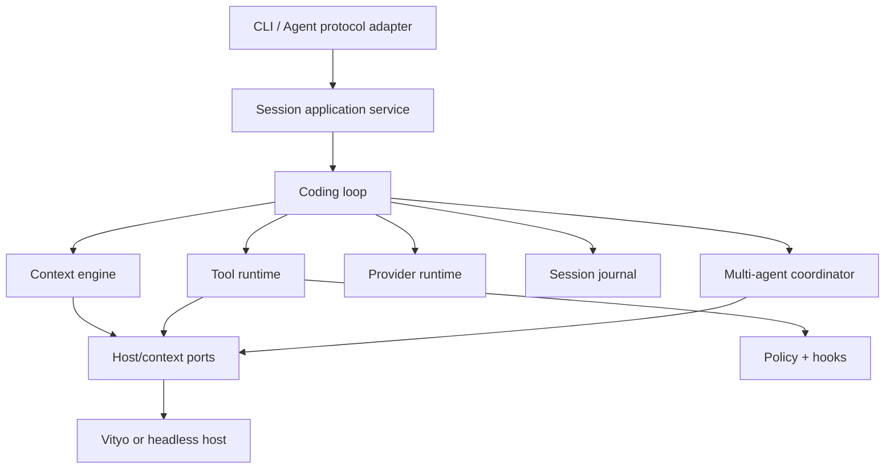

# Vityo Coding Agent — Architecture

**Plan:** `vityo-coding-agent`
**Purpose:** Define the standalone runtime, state owners, algorithms, safety boundaries, and IDE seam.
**Last updated:** 2026-07-26

## 1. Product topology

```text
products/vityo_coding_agent/
  pubspec.yaml
  bin/
    vityo_coding_agent.dart
  lib/
    vityo_coding_agent.dart
    src/
      application/             # session/task use cases
      protocol/                # Agent-side adapter to shared DTOs
      providers/               # model/provider ports and adapters
      context/                 # evidence providers, ranking, cache, compaction
      tools/                   # registry, MCP client, execution, result limits
      policy/                  # permissions, roots, network, secrets, hooks
      orchestration/           # plan/step loop, validation, repair guards
      sessions/                # append-only events, projections, recovery
      multi_agent/             # DAG scheduler, worktrees, leases, integration
      hosts/                   # controlled headless host adapter
  test/
  integration_test/
  benchmark/
  fixtures/
```

The package depends on `packages/vityo_agent_protocol` and pure runtime libraries only. It cannot
depend on `products/vityo_app`, Flutter, IDE document types, widget state, or IDE data stores.

## 2. Ports and dependency direction



Outer adapters translate transports. Application and domain layers contain no process, filesystem,
network, credential-store, or UI calls. Effects happen only through injected ports.

## 3. Core interfaces

| Interface | Responsibility |
|---|---|
| `AgentSessionEndpoint` | initialize, negotiate, create/load/cancel sessions, stream correlated events |
| `ModelProvider` | capability discovery, streamed generation/tool calls, cancellation, usage and failure taxonomy |
| `ContextSource` | return revisioned, provenance-bearing evidence under an explicit query and budget |
| `ToolCatalog` / `ToolExecutor` | dynamic schema discovery and bounded typed execution |
| `PolicyEvaluator` | combine risk class, roots, identity, grants, hook outcomes, and revocation state |
| `HostWorkspace` | search/read facts, propose transactions, run approved IDE operations, return receipts |
| `SessionEventStore` | append committed events, load by session/sequence, checkpoint compact projections |
| `WorktreeProvider` | create/isolate/inspect/dispose worker worktrees through host authority |

Interfaces return typed results; expected unavailability is not an exception string.

## 4. Session and event model

Stable identifiers form the correlation hierarchy:

```text
task -> session -> turn -> plan -> step -> tool_call / change_set / validation
```

The durable source is an append-only sequence of immutable events with monotonic per-session sequence
numbers and idempotency keys for effects. A compact projection serves current UI/state. Checkpoints
record the last applied sequence and provider/tool continuation tokens without raw secrets.

Only a committed event can advance durable state. On restart, a projection replays from its
checkpoint; an effect with an existing idempotency receipt is observed rather than repeated. A
corrupted tail is quarantined and reported without discarding the valid prefix.

## 5. Context engine

Context is a set of evidence records:

```text
id, source, resource, revision, range, sensitivity, score,
content_digest, byte/token cost, truncated, provenance
```

Selection uses:

1. hard inclusion for explicit user attachments and current focus;
2. invalidation by resource revision;
3. candidate retrieval from diagnostics, changed files, symbol/search indexes, and recent receipts;
4. stable deduplication by digest/resource/range;
5. weighted relevance scoring with deterministic tie-breaking;
6. greedy budget packing with per-source caps and a reserved response/tool budget;
7. deterministic compaction summaries when conversation history exceeds its hot window.

Hot lookups use maps keyed by stable IDs and revisions, bounded LRU caches for materialized content,
and interval/range indexes for overlapping evidence. No prompt build performs an unconditional
whole-workspace scan. Cache eviction exposes hit/miss/eviction metrics without content leakage.

## 6. Tools, policy, and hooks

Tool schemas are immutable descriptors indexed by stable namespaced ID and version. A session view is
filtered by task relevance, provider support, current roots, policy, and dynamic availability.

Execution order:

1. validate schema and size;
2. resolve current tool capability and roots;
3. classify risk/effect/idempotency;
4. run pre-execution policy and hooks;
5. request host permission when required;
6. execute through the narrow adapter with cancellation/deadline;
7. validate, bound, and redact the result;
8. run post-execution hooks/scans;
9. append the audit/effect receipt;
10. expose the result as untrusted evidence.

Exact tool rules use hash maps; ordered glob/path/network rules compile once into matchers. Policy
snapshots are immutable and versioned so revocation invalidates cached decisions. Secrets remain
opaque references and are resolved only by the intended execution adapter. Token passthrough is
forbidden.

## 7. Coding loop

The loop is an explicit state machine:

```text
understand -> plan -> ready -> act -> observe -> verify
                                  ^               |
                                  |---- repair ---|
```

Each plan step has a goal, ownership scope, prerequisites, acceptance criteria, expected tools, and
budget. The ready queue contains only steps whose prerequisites and resource leases are satisfied.
The loop limits model turns, tool rounds, elapsed time, cost, repeated identical failures, and repair
attempts. A loop guard reports the evidence and blocker when limits are reached.

Edits are immutable change sets tied to host revisions. The Agent proposes; the host previews,
validates conflicts, and commits. Verification re-reads diagnostics/tests/receipts after commit rather
than trusting tool prose.

## 8. Multi-agent scheduling

A task graph is a DAG with adjacency lists, indegree counts, and a deterministic ready priority queue.
A semaphore bounds global concurrency. A resource lease registry maps normalized ownership scopes to
one active worker. Each worker receives:

- an isolated worktree or read-only task view;
- a scoped context budget and tool catalog;
- its own session journal and cancellation token;
- explicit deliverable and acceptance criteria.

Completion produces a change set and evidence bundle. The coordinator never silently merges it:
integration acquires the target lease, revalidates the base, presents conflicts/review, and records the
decision. Cancellation propagates down the task tree and releases leases/worktrees deterministically.

## 9. Concurrency model

One serialized actor/event queue owns each session. Provider streams and tools may run concurrently
only when their step graph and effect classification permit it. Mutable state is never shared between
session actors; cross-session data is immutable or accessed through bounded synchronized stores.
Backpressure limits protocol events, provider chunks, tool output, and journal buffers.

## 10. Migration ownership

The atomic repository cutover moves existing Agent code to this root and deletes old paths. Subsequent
Coding Agent lifecycles replace the moved implementation in bounded closures:

- headless runtime removes Flutter and concrete IDE dependencies;
- providers split transport/routing/stream/budget state;
- context replaces the oversized all-in-one snapshot;
- tools/policy replace embedded permission and execution branches;
- coding loop replaces controller-owned orchestration;
- sessions replace mixed history/checkpoint state;
- multi-agent adds real scheduling/worktrees rather than registry-only roles;
- protocol integration proves the real Vityo seam.

No old class is retained as a forwarding facade after its owning lifecycle closes.
