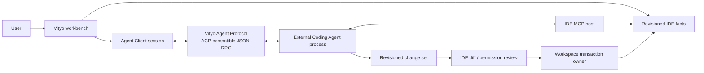

# Vityo — Architecture

**Plan:** `vityo`
**Purpose:** Define the target Styio Agent-Native IDE boundary, open Agent Client architecture, and one-time package cutover.
**Last updated:** 2026-07-30

## 1. Repository topology

```text
products/
  vityo_app/
    pubspec.yaml
    lib/
      main.dart
      src/
        app/                    # composition root only
        ide/                    # Flutter-free IDE domain/application
          editor/
          workspace/
          workbench/
          language/
          execution/
          debugger/
          source_control/
          terminal/
          toolchain/
          extensions/
          agent_client/
        presentation/           # Flutter surfaces and projections
          editor/
          workbench/
          agent_workbench/
    test/
    integration_test/
    benchmark/

  vityo_coding_agent/           # first-party companion runtime; never imported

packages/
  vityo_agent_protocol/
    schema/                     # canonical versioned wire schemas
    lib/                        # generated/validated pure Dart DTOs
    test/                       # protocol and compatibility fixtures
```

`products/vityo_app/lib/src/app` may depend on IDE domain, presentation, and the protocol package.
Presentation may consume narrow IDE models/interfaces. IDE domain may depend on the protocol package
but not presentation. No path imports Coding Agent implementation.

## 2. Completed atomic cutover barrier

The first IDE lifecycle completed the repository-wide structural cutover. This section is historical
architecture evidence and must not be executed again.

The completed cutover:

1. creates the three final roots;
2. moves IDE domain/presentation and Agent runtime to their final owners;
3. extracts a minimal typed process boundary;
4. updates package names, imports, scripts, CI, packaging, tests, and current documentation;
5. removes `frontend/vityo_app`, duplicate top-level exports, old boundary exceptions, and obsolete
   Vityo product metadata;
6. proves both new roots build and the IDE launches with the Agent absent.

This is a single migration lifecycle and commit boundary. There is no long-lived dual-read,
dual-write, deprecated export, or “phase 2 cleanup” path. Git history is the migration record.

After the cutover, ordinary IDE nodes own only `products/vityo_app`, IDE-specific gates/docs, and
protocol changes for which the IDE is the producer. Coding Agent nodes own only their companion
runtime root.

The remaining legacy provider/controller files inside `products/vityo_app` are not a reason to
repeat package cutover. They are removed by the dedicated protocol-only Agent-boundary Node.

## 3. Runtime dependency model



The IDE and Agent exchange immutable messages. The IDE does not expose controller objects, and the
Agent does not send arbitrary callbacks into widgets.

## 4. IDE-owned state

| Owner | Canonical state | Data structure / algorithm |
|---|---|---|
| Document store | source text, selections, document revision | existing piece/persistent-buffer strategy plus monotonic revision |
| Workspace transaction service | preview, base revisions, edits, conflicts, commit/rollback receipt | immutable edit list keyed by resource; interval/range validation; one serialized commit lane per workspace |
| Capability registry | language/execution/debug/SCM/tool availability and degradation | identifier map plus immutable snapshots; evented invalidation |
| Agent Client registry | Agent descriptors, processes, negotiated capabilities | maps keyed by Agent/session ID; explicit lifecycle state machine |
| Collaboration store | task/thread summaries, turns, steps, tool calls, artifacts, approvals | normalized ID maps plus bounded per-session deques/ring buffers |
| Context export | revisioned resources, diagnostics, symbols, selections, receipts | lazy providers; provenance records; size/token budgets; deduplication by stable content digest |

UI state is a projection. Durable session truth comes from protocol events and IDE receipts, not
widget lifetime.

## 5. Agent Client protocol

The Vityo-owned shared protocol package implements ACP-compatible core session semantics:

- initialize and capability negotiation;
- create/load/cancel session;
- streamed messages, plans, steps, tool calls, terminal output, artifacts, and usage;
- bidirectional permission and elicitation requests;
- concurrent session identifiers and correlated cancellation;
- capability-added/removed notifications;
- structured errors and unsupported-version failure.

The default local transport is a supervised stdio child process. Transport interfaces remain
separate so a future remote adapter does not change session semantics. Styio extensions are prefixed,
versioned, capability-negotiated, and limited to facts not already expressible by ACP/MCP.

The IDE also runs an MCP-compatible host for reusable tools/resources/prompts. Workspace roots are
explicit capabilities. The root registry resolves canonical paths, rejects traversal/symlink escape,
notifies changes, and re-evaluates open sessions after revocation.

## 6. Collaboration workbench

The Agent experience is a first-class workbench feature:

- task center: active, waiting-for-user, blocked, completed, failed, cancelled;
- thread: user/Agent turns, plan, steps, usage, context summary;
- activity timeline: tool start/end, permission, terminal, diagnostics, validation;
- changes: per-file/hunk diff, base revision, conflicts, apply/reject/revert;
- controls: steer, cancel, retry, reconnect, switch Agent;
- persistent notifications: pending permission/review survives panel navigation.

Each session has a serialized event reducer. Different sessions reduce concurrently and never share
mutable lists. Rendering consumes immutable snapshots; long histories use virtualization and bounded
hot windows backed by durable storage.

## 7. Security and failure isolation

1. Agent processes receive only intended environment variables. Model/provider credentials are
   resolved inside the Agent runtime and are never owned or relayed by the IDE.
2. Tool declarations and read-only hints are inputs to policy, not authority.
3. Permission decisions include session, tool, root/resource, risk class, expiry, and policy source.
4. Revocation invalidates cached grants before the next effect.
5. Protocol, MCP, tool, and terminal payloads are size-bounded and redacted.
6. Each Agent process has supervised termination, grace, kill, and orphan verification.
7. A failed process/session cannot corrupt editor state or terminate sibling sessions.

## 8. Node ownership

| Lifecycle | Primary ownership |
|---|---|
| Atomic package-boundary cutover | final source roots, package metadata, import rewrite, repository gates, deletion of old roots |
| Authoritative workspace transactions | `ide/editor`, `ide/workspace`, transaction and stale-edit tests |
| Truthful developer loop | language/execution/debug/SCM/terminal/toolchain facts and receipts |
| Agent Client protocol | `ide/agent_client`, Vityo-owned protocol schema/DTOs, process supervisor |
| Collaboration workbench | presentation/task/thread/timeline/review state and surfaces |
| MCP/context/extension export | IDE tool adapters, MCP host, root registry, capability discovery |
| Quality and desktop delivery | performance, accessibility, crash isolation, Windows/macOS/Linux packaging |
| Protocol-only Agent convergence | remove IDE model/provider, coding-loop, Agent policy, and durable-session ownership; retain Agent Client, context export, Workbench projections, permissions, and workspace transactions |
| Final-harness readiness | side-effect-free full-suite preflight, portable lifecycle boundary, complete bounded failure receipts; no real full run |
| Final validation | one immutable-candidate IDE full run and one per-requirement receipt |

## 9. Remaining execution sequence

```text
protocol-only Agent convergence
  -> final-harness readiness
  -> final platform-independent IDE validation
```

The exact UUIDs, phase-by-phase methods, failure routing, and stop rules are defined in
[the execution runbook](../EXECUTION-RUNBOOK.md). This sequence is serialized so a simple executor
cannot validate the product before removing the known ownership violation or repair the harness
during the final run.

## 10. Deliberate exclusions

- No service locator across the IDE/Agent package boundary.
- No global event bus shared with Agent runtime.
- No direct filesystem mutation for Agent edits.
- No direct model/provider connection, tool loop, durable Agent session, or multi-Agent scheduler in
  the IDE.
- No giant Agent-context object; context is requested through narrow lazy providers.
- No compatibility export roots after cutover.
- No new framework migration for editor buffers or state management unless a measured requirement
  cannot be met with current primitives.
